# <span style="color:hsl(55,80%,50%)">learning-mtls — Mutual TLS between Spring Boot services</span>

## <span style="color:hsl(141,80%,58%)">Table of contents</span>

1. 🎯 [Overview](#overview)
2. 🧩 [Modules](#modules)
3. 🏗️ [Maven structure](#maven-structure)
4. 🔑 [Certificates and generate scripts](#certificates)
5. 🛡️ [Security goals and threat model](#security-goals)
6. 🧮 [Cryptographic building blocks](#crypto-building-blocks)
    - 6.1 [Symmetric encryption — AES](#symmetric-encryption)
    - 6.2 [Asymmetric cryptography — RSA and elliptic curves](#asymmetric-cryptography)
    - 6.3 [Hash functions — SHA-2](#hash-functions)
    - 6.4 [MAC and HMAC](#mac-and-hmac)
    - 6.5 [Digital signatures — RSA-PSS](#digital-signatures)
    - 6.6 [Key exchange — ECDHE and forward secrecy](#key-exchange)
    - 6.7 [Key derivation — HKDF and PBKDF2](#key-derivation)
    - 6.8 [AEAD — AES-GCM](#aead)
    - 6.9 [Salt, IV, nonce and randomness](#salt-iv-nonce)
7. 📜 [PKI — keys, certificates and CAs](#pki)
    - 7.1 [Certificate Authority and chain of trust](#chain-of-trust)
    - 7.2 [How a certificate is issued (CSR flow)](#csr-flow)
    - 7.3 [X.509 certificate anatomy](#x509-certificate-anatomy)
    - 7.4 [Certificate path validation (PKIX)](#path-validation)
    - 7.5 [Hostname verification — SAN vs CN](#hostname-verification)
    - 7.6 [Revocation — CRL and OCSP](#revocation)
8. 🗄️ [Keystores, truststores and file formats](#stores-and-formats)
    - 8.1 [Keystore vs truststore](#keystore-vs-truststore)
    - 8.2 [PKCS#12 internals — how a `.p12` is protected](#pkcs12-internals)
    - 8.3 [File formats — PEM, DER, PKCS#1/#8/#10/#12, JKS](#file-formats)
9. 🔐 [TLS protocol](#tls-protocol)
    - 9.1 [TLS layers — handshake and record protocol](#tls-layers)
    - 9.2 [TLS 1.2 vs TLS 1.3](#tls12-vs-tls13)
    - 9.3 [Cipher suite anatomy](#cipher-suites)
    - 9.4 [What this project actually negotiates](#negotiated-parameters)
    - 9.5 [The mTLS handshake step by step](#the-mtls-handshake)
    - 9.6 [TLS 1.3 key schedule](#key-schedule)
    - 9.7 [TLS alerts and what they mean](#tls-alerts)
10. 🧷 [Authentication vs authorization](#authn-vs-authz)
11. 🌱 [How Spring Boot wires TLS (SSL bundles → JSSE)](#spring-ssl-wiring)
12. 🔑 [Secrets at rest — Jasypt `ENC(...)`](#secrets-at-rest)
13. 🔍 [Inspecting and debugging](#inspecting-the-material)
14. 🏭 [Production hardening checklist](#production-hardening)
15. 📖 [Glossary](#glossary)
16. 🚀 [Quick start](#quick-start)
17. 🔨 [Maven commands](#maven-commands)
18. 🧪 [Insomnia collection](#insomnia)
    - 18.1 [Import the collection](#insomnia-import)
    - 18.2 [Add the CA certificate — before calling any API](#insomnia-ca-certificate)
    - 18.3 [Add the client certificates — producer calls](#insomnia-client-certificates)
    - 18.4 [Folders and expected results](#insomnia-folders)
    - 18.5 [Troubleshooting](#insomnia-troubleshooting)

<a id="overview"></a>
## <span style="color:hsl(278,80%,58%)">1. 🎯 Overview</span>

Two Spring Boot 4.1 services that talk over **HTTPS with mutual TLS**: each side proves its
identity with an X.509 certificate issued by a private demo CA, and each side validates the
other's certificate. The producer stores data in PostgreSQL and keeps its DB password
encrypted in configuration.

Just want to run it? Jump to [Quick start](#quick-start).

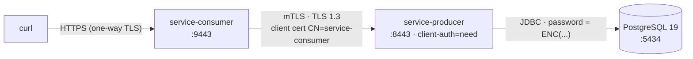

<a id="modules"></a>
## <span style="color:hsl(193,80%,58%)">2. 🧩 Modules</span>

| Module | Role | Docs |
|----|----|----|
| [`service-producer`](service-producer) | mTLS server; reads greetings from PostgreSQL; CN allow-list; Jasypt-encrypted DB password | [README](service-producer/README.md) |
| [`service-consumer`](service-consumer) | mTLS client; calls the producer with its client cert via an OpenFeign client (`@FeignClient`) on the SSL bundle | [README](service-consumer/README.md) |
| `docker-compose.yml` | PostgreSQL `19beta3` for the producer (host port 5434) | — |
| `insomnia-certs` (git-ignored) | Shared root CA (`ca.key`, `ca.crt`) + PEM copies for `curl` / `openssl`. Written by the generate scripts, or extracted from the committed stores ([Quick start](#quick-start)) | — |

<a id="maven-structure"></a>
## <span style="color:hsl(331,80%,58%)">3. 🏗️ Maven structure</span>

```
org.springframework.boot:spring-boot-starter-parent:4.1.0
└── com.org.llm:super-pom:1.0.0           (Java 25, learning-bom, build-info, git-commit-id, enforcer, Surefire/Failsafe, profiles)
    └── com.org.mtls:learning-mtls        (this aggregator — shared deps: webmvc, actuator, Lombok, DevTools, webmvc-test;
        │                                  manages jasypt-spring-boot-starter 4.0.4)
        ├── service-producer
        └── service-consumer
```

`super-pom` is **not on Maven Central**. The aggregator declares it with an empty `<relativePath/>`,
so it must already be in your local repository (`mvn install` it from its own project). Its enforcer
accepts Java 21+ and Maven 3.9+, but `maven.compiler.release` is 25, so the build needs **JDK 25 or
newer**. `learning-bom` also imports Spring Cloud 2025.1.2, which declares Boot 4.0.x and 4.1.x
compatible. The consumer's OpenFeign and Feign versions come from there.

<a id="certificates"></a>
## <span style="color:hsl(56,80%,50%)">4. 🔑 Certificates and generate scripts</span>

Each module owns a script next to its stores:

| Script | Writes |
|---|---|
| `service-producer/src/main/resources/ssl/generate-certs.sh` | `main/…/ssl/service-producer-keystore.p12`, `main/…/ssl/truststore.p12`, `test/…/ssl/service-consumer-keystore.p12`, `test/…/ssl/service-unknown-keystore.p12` |
| `service-consumer/src/main/resources/ssl/generate-certs.sh` | `main/…/ssl/service-consumer-keystore.p12`, `main/…/ssl/truststore.p12` |

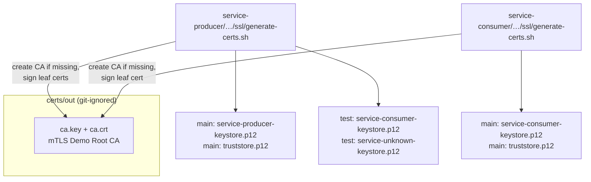

Both scripts sign with the **same root CA**. Whichever runs first creates it; the other reuses
it. If the CA is ever recreated, run **both** scripts so both truststores contain the new CA.
Scripts are excluded from the jars (`maven-jar-plugin`). The committed `.p12` files are demo
material so the project runs out of the box; `ca.key` is never committed.

```bash
service-consumer/src/main/resources/ssl/generate-certs.sh
service-producer/src/main/resources/ssl/generate-certs.sh
# optional overrides: STORE_PASSWORD (default changeit), CA_DIR (default <repo>/certs/out)
```

Things worth knowing before you run them:

- **Running a script re-issues the committed `.p12` files.** To just get PEM files for `curl` on a
  fresh clone, extract them from the committed stores instead ([Quick start](#quick-start), step 3).
- **There are two `CN=service-consumer` certificates.** The consumer's script issues the consumer's
  real keystore. The producer's script issues the producer's *test* keystore (the integration-test
  client). They are separate key pairs with different serials, from the same CA and with the same
  CN. The producer accepts both because it only checks the chain and the CN.
- Both scripts write `insomnia-certs`, so the PEM pair there belongs to
  whichever script ran last. Either pair works for `curl`.
- **`insomnia-certs` exists only on your disk.** No committed store contains it. If you delete
  `insomnia-certs`, the next script run creates a new CA, so run **both** scripts afterwards. The CA
  *certificate* can always be re-extracted from a committed truststore ([Quick start](#quick-start), step 3).

<a id="security-goals"></a>
## <span style="color:hsl(0,75%,60%)">5. 🛡️ Security goals and threat model</span>

| Goal | Meaning | Provided here by |
|---|---|---|
| **Confidentiality** | Only the two endpoints can read the traffic | TLS record encryption (AES-256-GCM) |
| **Integrity** | Tampering is detected | AEAD tag (GCM) on every TLS record |
| **Server authentication** | Consumer knows it's really talking to the producer | Producer cert chains to trusted CA + SAN matches host + `CertificateVerify` |
| **Client authentication** | Producer knows it's really the consumer | `client-auth: need` + consumer cert + `CertificateVerify` |
| **Authorization** | Authenticated caller is *allowed* to call this API | `ClientCertificateFilter` CN allow-list |
| **Forward secrecy** | Stolen long-term key can't decrypt past traffic | Ephemeral ECDHE (X25519) key exchange |
| **Secrets at rest** | DB password not readable from config | Jasypt `ENC(...)` (PBKDF2 + AES-256-CBC) |

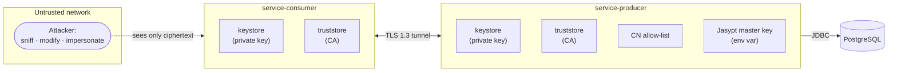

| Threat | Without mTLS | Control in this project | What the attacker sees |
|---|---|---|---|
| Eavesdropping on the wire | Reads JSON, names | AES-256-GCM record encryption | Random-looking bytes |
| Man-in-the-middle posing as producer | Consumer talks to attacker | Consumer validates producer chain + SAN + `CertificateVerify` | Handshake fails: `PKIX path building failed` |
| Unknown client calling producer | Anyone can call the API | `client-auth: need` | Handshake fails (no/untrusted cert) |
| Valid-but-wrong service calling producer | — | CN allow-list | `403 Forbidden` |
| Replay / reorder of records | — | TLS sequence numbers inside AEAD nonce | Records rejected, connection closed |
| Private key stolen later | Past traffic decryptable (static RSA) | ECDHE forward secrecy | Past sessions stay secret |
| Config file / repo leak | DB password exposed | Jasypt `ENC(...)`, master key only in env | Ciphertext only |
| Downgrade to old TLS | Weak protocol negotiated | `enabled-protocols: TLSv1.3,TLSv1.2` | TLS 1.1 refused (`protocol_version` alert) |

<a id="crypto-building-blocks"></a>
## <span style="color:hsl(200,80%,55%)">6. 🧮 Cryptographic building blocks</span>

Everything in TLS and in Jasypt is assembled from a small set of primitives.

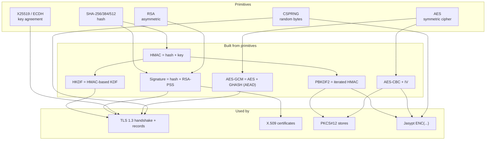

<a id="symmetric-encryption"></a>
### <span style="color:hsl(20,80%,58%)">6.1 Symmetric encryption — AES</span>

One **shared secret key** both encrypts and decrypts. Fast (hardware AES-NI), used for bulk data.

| Property | Value |
|---|---|
| Algorithm | AES (Rijndael), NIST standard |
| Block size | 128 bits (16 bytes) |
| Key sizes | 128 / 192 / **256** bits — this project uses AES-256 everywhere |
| Problem | Both sides need the same key → how do they agree on it over an untrusted network? → **key exchange** (6.6) |

A block cipher alone only encrypts one 16-byte block, so it needs a **mode of operation**:

| Mode | How | Used in | Notes |
|---|---|---|---|
| **CBC** | each block XOR-ed with previous ciphertext block; first block with an **IV** | Jasypt, PKCS#12 | Needs padding; no built-in integrity |
| **GCM** | counter mode + GHASH authentication tag | TLS 1.3 / 1.2 records | **AEAD** — encryption + integrity in one (6.8) |

<a id="asymmetric-cryptography"></a>
### <span style="color:hsl(80,80%,50%)">6.2 Asymmetric cryptography — RSA and elliptic curves</span>

A **key pair**: the **private key** stays secret, the **public key** is shared freely (inside a
certificate). What one key does, only the other can undo/verify.

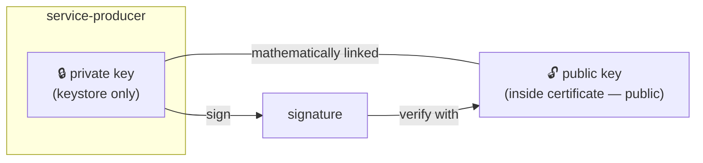

| Algorithm | Based on | Role here | Size |
|---|---|---|---|
| **RSA** | Difficulty of factoring large numbers | Certificate keys; signing `CertificateVerify`; CA signing certs | 2048-bit leaves, 4096-bit CA |
| **X25519** (ECDH on Curve25519) | Elliptic-curve discrete log | Ephemeral TLS key exchange | 253-bit (~128-bit security) |
| ECDSA / Ed25519 | Elliptic curves | Alternative cert key types (not used here) | — |

In TLS 1.3, **RSA is only used for signatures**, never to encrypt the session key — that job
belongs to ECDHE, which is what gives forward secrecy.

<a id="hash-functions"></a>
### <span style="color:hsl(300,70%,60%)">6.3 Hash functions — SHA-2</span>

A hash maps any input to a fixed-size **fingerprint**. One-way (can't reverse), collision-resistant
(can't find two inputs with the same hash), avalanche (1-bit change → totally different output).

| Function | Output | Used for |
|---|---|---|
| SHA-256 | 32 bytes | Cert signatures (`sha256WithRSAEncryption`), RSA-PSS in handshake, PKCS#12 MAC, cert fingerprints |
| SHA-384 | 48 bytes | TLS 1.3 transcript hash + HKDF for `TLS_AES_256_GCM_SHA384` |
| SHA-512 | 64 bytes | Jasypt's HMAC-SHA512 inside PBKDF2 |

<a id="mac-and-hmac"></a>
### <span style="color:hsl(165,80%,45%)">6.4 MAC and HMAC</span>

A **MAC** (Message Authentication Code) is a keyed checksum: only someone with the key can
produce or verify it, so it proves **integrity + origin** for symmetric-key holders.

**HMAC** builds a MAC from a hash: `HMAC(K, m) = H((K ⊕ opad) ‖ H((K ⊕ ipad) ‖ m))`.

| Where HMAC appears | Purpose |
|---|---|
| TLS 1.3 `Finished` message | HMAC over the whole handshake transcript — proves nobody altered any handshake message |
| HKDF (TLS key schedule) | Extract/expand keys from the ECDHE secret |
| PBKDF2 (PKCS#12, Jasypt) | Pseudo-random function iterated over password + salt |
| PKCS#12 integrity MAC | HMAC-SHA256 over the whole `.p12` — detects tampering / wrong password |

<a id="digital-signatures"></a>
### <span style="color:hsl(45,80%,50%)">6.5 Digital signatures — RSA-PSS</span>

A signature is "a MAC anyone can verify": created with the **private** key, verified with the
**public** key. It proves the signer holds the private key and the data wasn't changed.

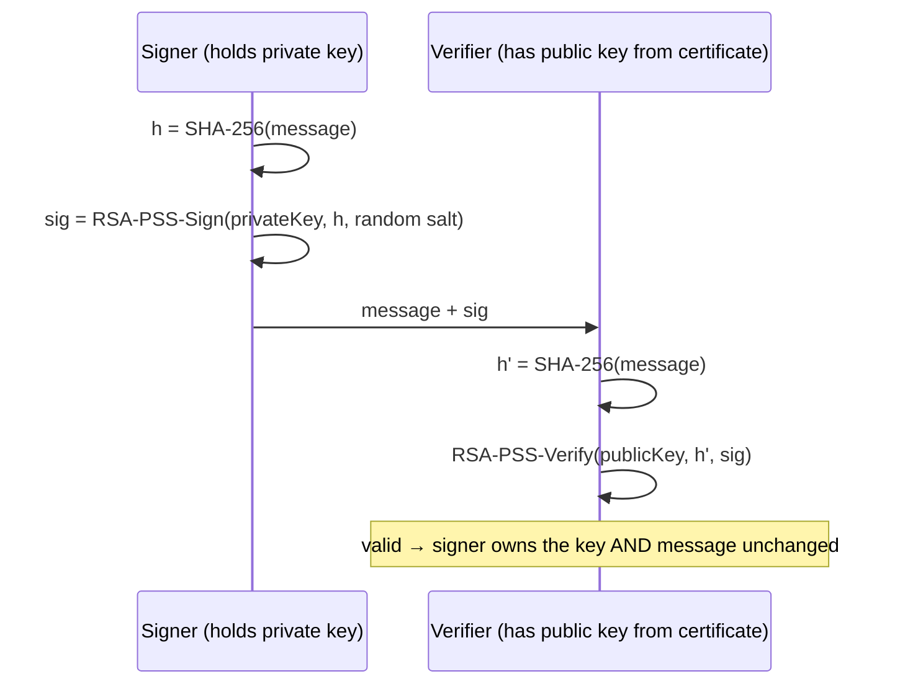

| Signature | Where | Scheme |
|---|---|---|
| CA → certificate | Each cert's body signed by CA key | `sha256WithRSAEncryption` (PKCS#1 v1.5) |
| Server `CertificateVerify` | Producer signs handshake transcript | `rsa_pss_rsae_sha256` (verified with `openssl s_client`) |
| Client `CertificateVerify` | Consumer signs handshake transcript | `rsa_pss_rsae_sha256` |

**PSS** (Probabilistic Signature Scheme) adds a random salt to each signature and has a
security proof; TLS 1.3 **requires** PSS for RSA handshake signatures (PKCS#1 v1.5 is only
allowed inside certificates).

<a id="key-exchange"></a>
### <span style="color:hsl(260,60%,65%)">6.6 Key exchange — ECDHE and forward secrecy</span>

**Diffie-Hellman** lets two parties derive the same secret over a public channel without ever
sending it. **E**phemeral **E**lliptic-**C**urve DH (ECDHE) does this with a fresh key pair per
connection.

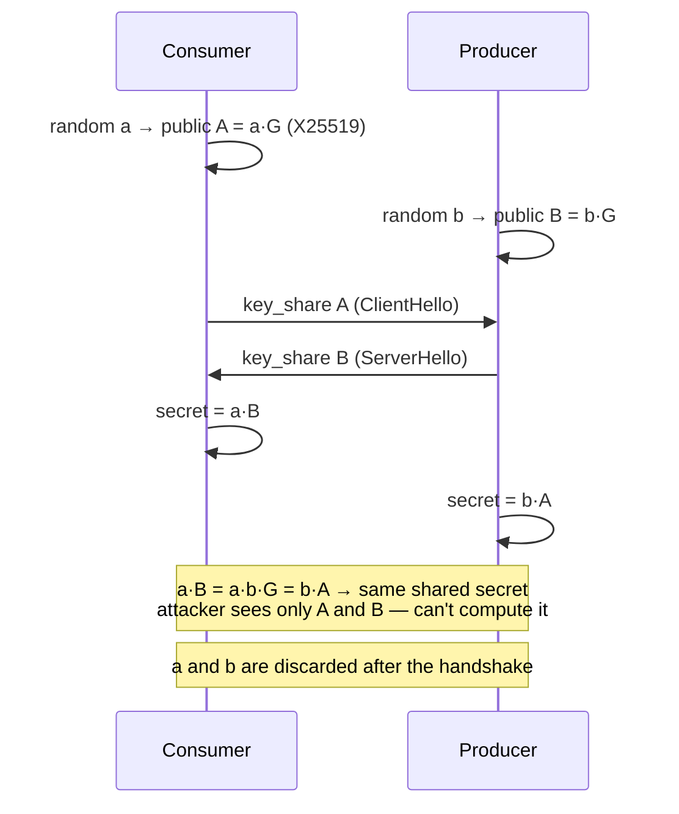

**Forward secrecy:** because `a` and `b` are thrown away, recording today's traffic and
stealing `service-producer`'s RSA private key next year **does not** let anyone decrypt it —
the RSA key only *signed* the handshake, it never protected the session key.

**Why the signature matters:** plain DH is anonymous — a MITM could run DH with both sides.
The server's `CertificateVerify` signature (and the client's, in mTLS) binds the DH values to
certificate identities, defeating the MITM.

<a id="key-derivation"></a>
### <span style="color:hsl(120,60%,45%)">6.7 Key derivation — HKDF and PBKDF2</span>

A **KDF** turns some secret material into one or more properly-sized cryptographic keys.

| KDF | Input | Speed | Used by |
|---|---|---|---|
| **HKDF** (HMAC-based extract-and-expand, RFC 5869) | High-entropy secret (ECDHE output) | Fast — input is already strong | TLS 1.3 key schedule (9.6) |
| **PBKDF2** (PKCS#5 v2, RFC 8018) | Low-entropy **password** + salt | **Deliberately slow** (iterations) to resist guessing | PKCS#12 stores (2048–10000 iters), Jasypt (1000 iters) |

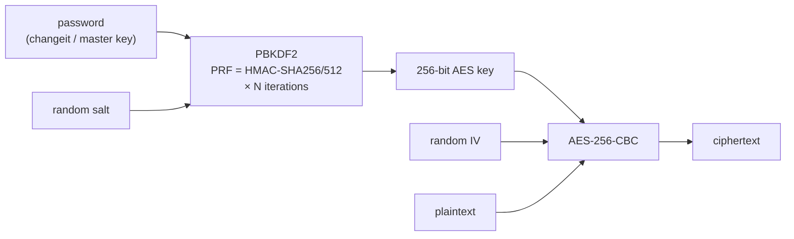

<a id="aead"></a>
### <span style="color:hsl(30,80%,55%)">6.8 AEAD — AES-GCM</span>

**A**uthenticated **E**ncryption with **A**ssociated **D**ata encrypts *and* authenticates in
one step. Every TLS 1.3 record is AEAD-protected.

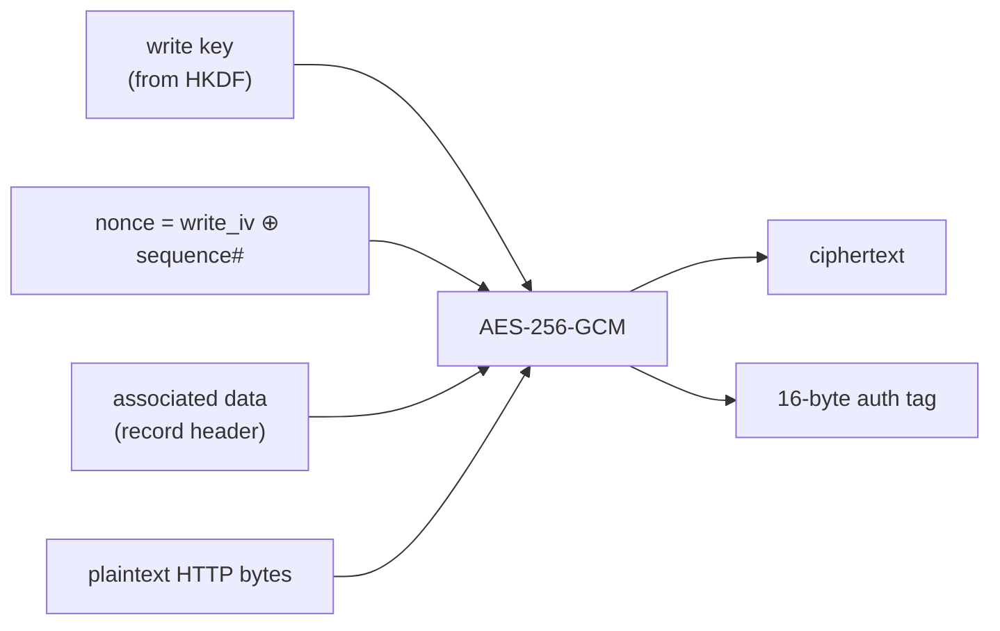

- Receiver recomputes the tag; any flipped bit → tag mismatch → `bad_record_mac` alert, connection dropped.
- The nonce includes the **record sequence number**, so replayed or reordered records fail.
- Contrast: AES-CBC (Jasypt, PKCS#12) needs a separate MAC for integrity — PKCS#12 adds an HMAC-SHA256; Jasypt relies on padding checks.

<a id="salt-iv-nonce"></a>
### <span style="color:hsl(340,70%,60%)">6.9 Salt, IV, nonce and randomness</span>

| Term | Secret? | Must be | Feeds | Purpose | Examples here |
|---|---|---|---|---|---|
| **Salt** | No — stored in clear | Random, unique per derivation | KDF (PBKDF2) | Same password → different key; defeats rainbow tables and cross-value comparison | 16 B in Jasypt `ENC`, 8–20 B in `.p12` |
| **IV** (Initialisation Vector) | No — stored in clear | Unpredictable for CBC | Cipher (CBC) | Same key + same plaintext → different ciphertext | 16 B in Jasypt `ENC` and `.p12` |
| **Nonce** ("number used once") | No | **Never repeat** with the same key | Cipher (GCM) | Uniqueness of every encryption; repeat = catastrophic | TLS record nonce = IV ⊕ seq# |
| **Random** (ClientHello/ServerHello) | No | Fresh per handshake | Key schedule | Makes every session's keys unique; anti-replay | 32 B each |
| **Ephemeral key** | **Yes** — discarded after use | Fresh per handshake | ECDHE | Forward secrecy | X25519 key share |

All of these come from a **CSPRNG** (`SecureRandom` in Java, `/dev/urandom`-backed in OpenSSL).
Weak randomness breaks everything above it.

<a id="pki"></a>
## <span style="color:hsl(193,80%,58%)">7. 📜 PKI — keys, certificates and CAs</span>

| Term | What it is | In this project |
|---|---|---|
| **Key pair** | Private + public key (6.2) | RSA-2048 per service, RSA-4096 for the CA |
| **Certificate** | CA-signed statement: *"this public key belongs to this identity, for these purposes, until this date"* | `service-producer.crt`, `service-consumer.crt`, `service-unknown.crt` |
| **CA** | Entity whose signature relying parties trust | `mTLS Demo Root CA` |
| **Root CA** | Self-signed CA (issuer = subject); trust is *configured*, not proven | `ca.crt` in both truststores |
| **Intermediate CA** | CA signed by the root, used for day-to-day issuing so the root key can stay offline | not used (demo) |
| **Leaf / end-entity** | Cert for an actual service, `CA:FALSE` | the three service certs |
| **PKI** | The whole system: CAs, certs, policies, revocation, stores | this repo's scripts + stores |

<a id="chain-of-trust"></a>
### <span style="color:hsl(20,80%,58%)">7.1 Certificate Authority and chain of trust</span>

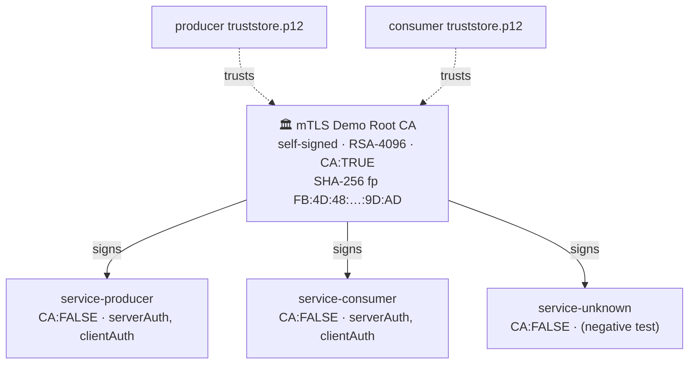

Trust is **transitive through signatures**: the producer never saw `service-consumer.crt`
before, but it trusts the root, and the root's signature on the consumer cert verifies — so the
consumer cert is trusted. `service-unknown` is equally trusted at the TLS layer; only the CN
allow-list (section 10) stops it. (The fingerprint above belongs to the committed demo CA; it
changes whenever the CA is regenerated.)

<a id="csr-flow"></a>
### <span style="color:hsl(80,80%,50%)">7.2 How a certificate is issued (CSR flow)</span>

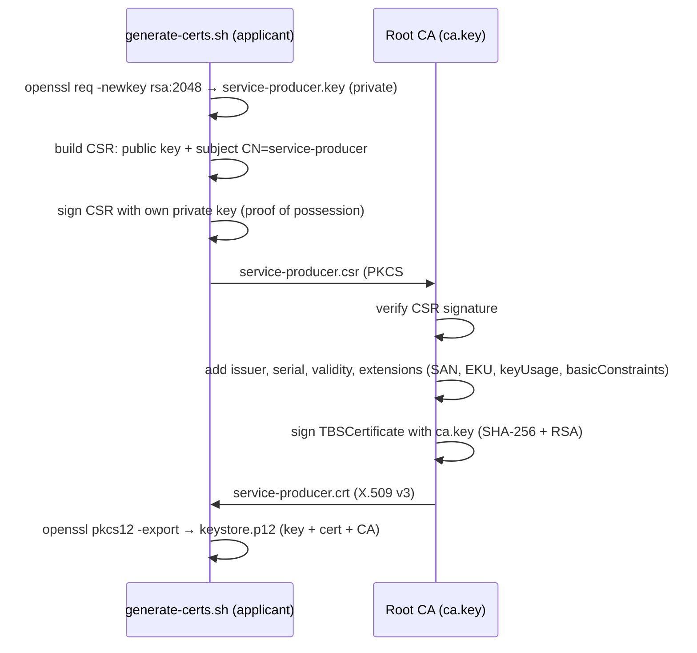

The private key **never leaves** the applicant — the CA only sees the public key in the CSR.

<a id="x509-certificate-anatomy"></a>
### <span style="color:hsl(300,70%,60%)">7.3 X.509 certificate anatomy</span>

**X.509** is the ITU-T standard that defines the format of a public-key certificate — a
data structure that binds a public key to an identity (the *subject*), signed by an
*issuer* (a CA), valid for a given period, and carrying extensions such as key usage and
subject alternative names. It's the certificate format used by TLS and, in this project,
by mTLS: every `.crt` file under `insomnia-certs` and every entry in a `.p12` store is an
X.509 certificate.

```
Certificate
├── TBSCertificate ("to be signed")
│   ├── Version                3 (v3)
│   ├── Serial number          53:10:A2:58:…            unique per CA
│   ├── Signature algorithm    sha256WithRSAEncryption
│   ├── Issuer                 CN=mTLS Demo Root CA, O=com.org
│   ├── Validity               notBefore … notAfter      825 days
│   ├── Subject                CN=service-producer, O=com.org
│   ├── SubjectPublicKeyInfo   RSA 2048-bit public key
│   └── Extensions (v3)
│       ├── basicConstraints   critical, CA:FALSE
│       ├── keyUsage           critical, digitalSignature, keyEncipherment
│       ├── extendedKeyUsage   serverAuth, clientAuth
│       ├── subjectAltName     DNS:service-producer, DNS:localhost, IP:127.0.0.1
│       ├── subjectKeyIdentifier     hash of this cert's public key    (added by OpenSSL)
│       └── authorityKeyIdentifier   = issuer's subjectKeyIdentifier    (added by OpenSSL)
├── signatureAlgorithm         sha256WithRSAEncryption
└── signatureValue             CA's RSA signature over TBSCertificate
```

| Extension | Critical? | Meaning |
|---|---|---|
| `basicConstraints` | yes | `CA:FALSE` → this cert may not sign other certs. The CA has `CA:TRUE` |
| `keyUsage` | yes | Raw key operations: `digitalSignature` (sign handshake), `keyEncipherment` (legacy RSA key transport). CA: `keyCertSign, cRLSign` |
| `extendedKeyUsage` | no | Protocol roles: `serverAuth` = may be a TLS server, `clientAuth` = may be a TLS client. Both set so one identity works in both directions |
| `subjectAltName` | no | Names the cert is valid for — **used for hostname verification** |
| `subjectKeyIdentifier` / `authorityKeyIdentifier` | no | Key IDs that link a cert to its issuer's key, which helps path building when a CA has several keys. OpenSSL 3 adds both automatically; the scripts don't ask for them |

*Critical* = a validator that doesn't understand the extension must reject the cert.

<a id="path-validation"></a>
### <span style="color:hsl(165,80%,45%)">7.4 Certificate path validation (PKIX)</span>

What the JSSE `TrustManager` does with the chain the peer sends (RFC 5280):

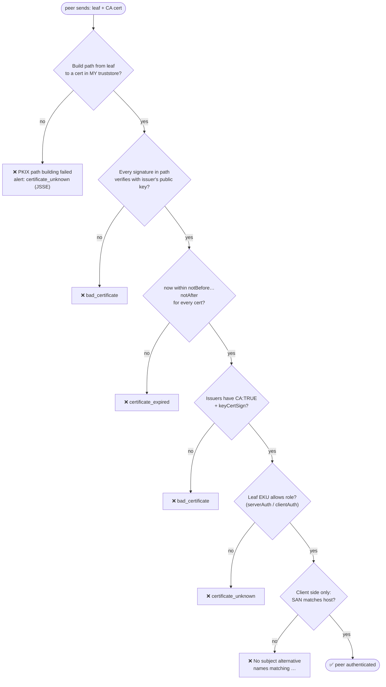

<a id="hostname-verification"></a>
### <span style="color:hsl(45,80%,50%)">7.5 Hostname verification — SAN vs CN</span>

| Field | Checked by | Question it answers |
|---|---|---|
| **SAN** (`subjectAltName`) | The **client** (consumer's Feign → JDK HttpClient, `curl`) | "Is this cert valid for the host I dialled?" — `https://localhost:8443` must match `DNS:localhost` |
| **CN** (Common Name) | Our **producer's** `ClientCertificateFilter` | "Which service is calling me?" — must be `service-consumer` |

Modern TLS clients **ignore CN for hostname checks** (RFC 6125) — SAN is mandatory. Calling
`https://127.0.0.1:8443` works because of `IP:127.0.0.1`; calling `https://myhost:8443` would
fail until `DNS:myhost` is added to the SAN and the cert reissued.

<a id="revocation"></a>
### <span style="color:hsl(260,60%,65%)">7.6 Revocation — CRL and OCSP</span>

A stolen key stays usable until its cert expires unless it can be **revoked**.

| Mechanism | How | Used here? |
|---|---|---|
| **CRL** (Certificate Revocation List) | CA publishes a signed list of revoked serials | No |
| **OCSP** | Client asks the CA's responder "is serial X still good?" | No |
| **OCSP stapling** | Server attaches a fresh OCSP response in the handshake | No |
| **Short-lived certs** | Certs valid for hours/days; no revocation needed | Recommended for production (cert-manager, SPIFFE) |

In this demo, "revoking" a service = regenerate the CA (run both scripts) or remove the CN
from `mtls.allowed-client-cns`.

<a id="stores-and-formats"></a>
## <span style="color:hsl(30,80%,55%)">8. 🗄️ Keystores, truststores and file formats</span>

<a id="keystore-vs-truststore"></a>
### <span style="color:hsl(20,80%,58%)">8.1 Keystore vs truststore</span>

Same file format (PKCS#12); different **contents** and **role**.

| | Keystore | Truststore |
|---|---|---|
| Answers | *"Who am I?"* | *"Whom do I trust?"* |
| Contains | **PrivateKeyEntry**: own private key + own cert + chain (CA cert) | **trustedCertEntry**: CA certificate(s) only — no private keys |
| Secret? | **Yes** — possession = ability to impersonate the service | No, but tamper-sensitive: adding a CA = trusting everything it signs |
| JSSE component | `KeyManager` — picks cert, signs `CertificateVerify` | `TrustManager` — runs path validation (7.4) |
| Spring Boot | `spring.ssl.bundle.jks.<name>.keystore.*` + `key.alias` | `spring.ssl.bundle.jks.<name>.truststore.*` |

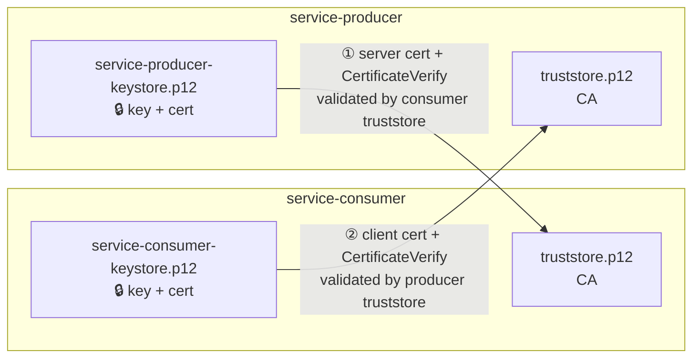

| File | Role | Entry | Alias |
|---|---|---|---|
| `service-producer/…/ssl/service-producer-keystore.p12` | keystore | PrivateKeyEntry (key + leaf + CA) | `service-producer` |
| `service-producer/…/ssl/truststore.p12` | truststore | trustedCertEntry | `mtls-demo-ca` |
| `service-consumer/…/ssl/service-consumer-keystore.p12` | keystore | PrivateKeyEntry | `service-consumer` |
| `service-consumer/…/ssl/truststore.p12` | truststore | trustedCertEntry | `mtls-demo-ca` |

<a id="pkcs12-internals"></a>
### <span style="color:hsl(80,80%,50%)">8.2 PKCS#12 internals — how a `.p12` is protected</span>

`openssl pkcs12 -info` on our files shows:

```
service-producer-keystore.p12
├── MAC: HMAC-SHA256, 2048 iterations, 8-byte salt          ← integrity of the whole file
├── Encrypted data (PBES2: PBKDF2-HMAC-SHA256 → AES-256-CBC, 2048 it.)
│   └── Certificate bags: service-producer.crt, ca.crt
└── Data
    └── Shrouded Keybag (PBES2: PBKDF2-HMAC-SHA256 → AES-256-CBC, 2048 it.)
        └── PKCS#8 private key                               ← encrypted at rest

truststore.p12  (created by keytool)
├── MAC: HMAC-SHA256, 10000 iterations, 20-byte salt
└── Encrypted data (PBES2: PBKDF2-HMAC-SHA256 → AES-256-CBC, 10000 it.)
    └── Certificate bag: ca.crt
```

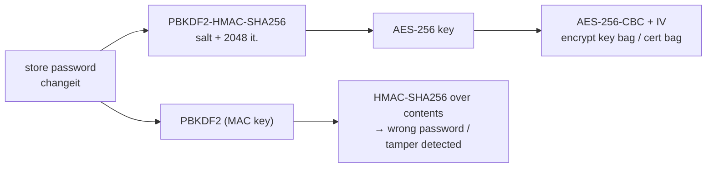

The same **PBES2 = PBKDF2 + AES-CBC** pattern protects Jasypt `ENC(...)` values (section 12).
The store password (`changeit`) is therefore the only thing protecting the private key at rest —
replace it for anything real.

<a id="file-formats"></a>
### <span style="color:hsl(300,70%,60%)">8.3 File formats — PEM, DER, PKCS#1/#8/#10/#12, JKS</span>

| Name | What it is | Where you meet it here |
|---|---|---|
| **ASN.1** | Abstract schema language all these structures are defined in | — |
| **DER** | Binary encoding of ASN.1 | inside everything below |
| **PEM** | Base64(DER) between `-----BEGIN …-----` / `-----END …-----` — text, copy-paste friendly | `insomnia-certs`, `*.key` (used by `curl`) |
| **PKCS#1** | RSA-only key format (`BEGIN RSA PRIVATE KEY`) | — |
| **PKCS#8** | Algorithm-agnostic private key (`BEGIN PRIVATE KEY`; encrypted variant `BEGIN ENCRYPTED PRIVATE KEY`) | `*.key`; inside `.p12` as shrouded keybag |
| **PKCS#10** | Certificate Signing Request (`BEGIN CERTIFICATE REQUEST`) | `*.csr` (temporary) |
| **PKCS#5 v2** | PBKDF2 + PBES2 password-based encryption | `.p12` protection, Jasypt |
| **PKCS#12** (`.p12` / `.pfx`) | Password-protected container of keys + certs; Java default keystore type since 9 | all `*.p12` |
| **JKS** | Legacy Java-proprietary keystore, weaker protection | not used (Spring's `jks` bundle prefix reads PKCS12 via `type: PKCS12`) |

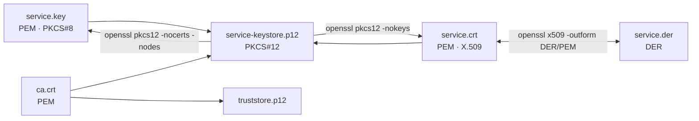

<a id="tls-protocol"></a>
## <span style="color:hsl(200,80%,55%)">9. 🔐 TLS protocol</span>

<a id="tls-layers"></a>
### <span style="color:hsl(20,80%,58%)">9.1 TLS layers — handshake and record protocol</span>

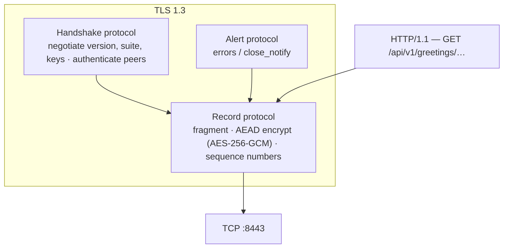

- **Handshake** runs once per connection: agrees on parameters, authenticates both sides, derives keys.
- **Record layer** then carries every byte (HTTP included) as encrypted, authenticated records.
- **HTTPS** is simply HTTP carried over TLS.

<a id="tls12-vs-tls13"></a>
### <span style="color:hsl(80,80%,50%)">9.2 TLS 1.2 vs TLS 1.3</span>

Both are enabled (`enabled-protocols: TLSv1.3,TLSv1.2`); TLS 1.3 is preferred and is what the
services negotiate. TLS 1.1 and below are refused.

| | TLS 1.2 | TLS 1.3 |
|---|---|---|
| Round trips before data | 2-RTT | **1-RTT** |
| Key exchange | RSA key transport *or* (EC)DHE | **(EC)DHE only** — forward secrecy mandatory |
| Handshake encryption | Certificates sent **in clear** | Everything after `ServerHello` **encrypted** (certs hidden from observers) |
| Cipher modes | CBC, GCM, … (many weak options) | **AEAD only** (AES-GCM, ChaCha20-Poly1305) |
| RSA signature | PKCS#1 v1.5 allowed | **RSA-PSS** required |
| Key derivation | PRF | HKDF with a clear key schedule |
| Suite naming | `ECDHE-RSA-AES256-GCM-SHA384` (kx + auth + cipher + hash) | `TLS_AES_256_GCM_SHA384` (cipher + hash only; kx/auth negotiated separately) |

<a id="cipher-suites"></a>
### <span style="color:hsl(300,70%,60%)">9.3 Cipher suite anatomy</span>

```
TLS 1.3:   TLS _ AES_256_GCM _ SHA384
                  │             └── hash for HKDF key schedule + transcript
                  └── AEAD record cipher (AES, 256-bit key, GCM mode)
           key exchange   → negotiated via "supported_groups"      (X25519)
           authentication → negotiated via "signature_algorithms"  (rsa_pss_rsae_sha256)

TLS 1.2:   ECDHE - RSA - AES256-GCM - SHA384
             │      │        │          └── PRF hash
             │      │        └── record cipher
             │      └── authentication (server's RSA cert signs)
             └── key exchange (ephemeral ECDH)
```

<a id="negotiated-parameters"></a>
### <span style="color:hsl(165,80%,45%)">9.4 What this project actually negotiates</span>

Verified with `openssl s_client` (OpenSSL 3.5) and `-Djavax.net.debug=ssl:handshake` on the consumer (JDK 25 and JDK 26 give the same results):

| Parameter | Consumer (JDK) → Producer | `openssl s_client` → Producer | `-tls1_2` forced |
|---|---|---|---|
| Protocol | **TLSv1.3** | TLSv1.3 | TLSv1.2 |
| Cipher suite | `TLS_AES_256_GCM_SHA384` | `TLS_AES_256_GCM_SHA384` | `ECDHE-RSA-AES256-GCM-SHA384` |
| Key exchange group | `x25519` | X25519 (253 bits) | X25519 (253 bits) |
| Server signature | `rsa_pss_rsae_sha256` | `rsa_pss_rsae_sha256` | `rsa_pss_rsae_sha256` (signs `ServerKeyExchange`) |
| Client signature (`CertificateVerify`) | `rsa_pss_rsae_sha256` | — | — |
| Server key | RSA 2048 | RSA 2048 | RSA 2048 |
| Client CAs requested by producer | `certificate_authorities` extension: `CN=mTLS Demo Root CA, O=com.org` | `CN=mTLS Demo Root CA, O=com.org` | same |
| TLS 1.1 attempt | — | refused — alert 70 `protocol_version` | — |

<a id="the-mtls-handshake"></a>
### <span style="color:hsl(45,80%,50%)">9.5 The mTLS handshake step by step (TLS 1.3)</span>

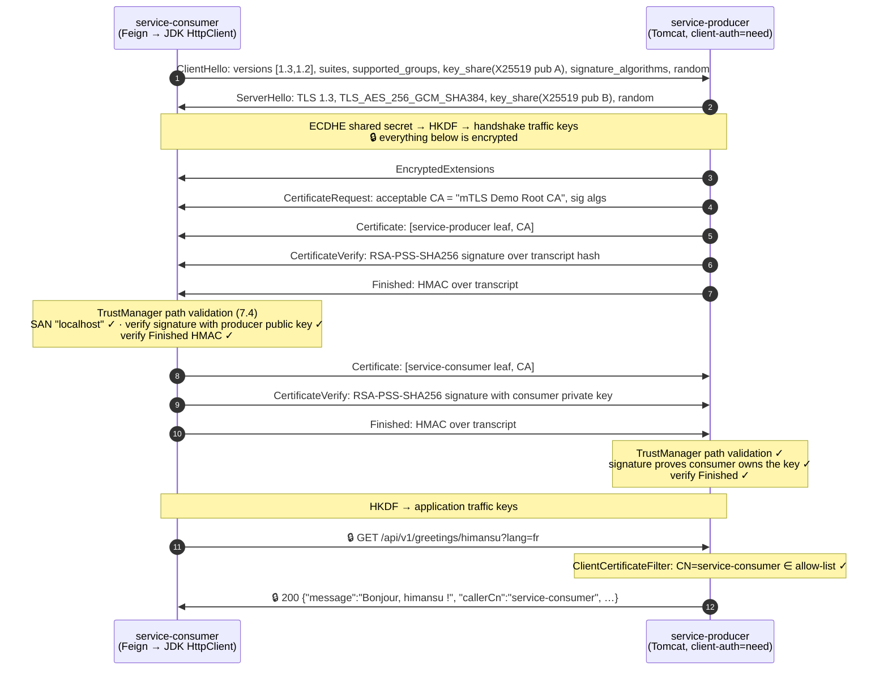

| Step | Message | Why it matters |
|---|---|---|
| 1–2 | Hello messages + key shares | Agree on TLS 1.3 + suite; exchange ephemeral X25519 public keys |
| 3 | EncryptedExtensions | First encrypted message — rest of handshake hidden from observers |
| 4 | **CertificateRequest** | Sent only because `client-auth: need`; lists acceptable CA names from the producer truststore |
| 5–6 | Server Certificate + **CertificateVerify** | Cert is public; the signature proves the producer holds the private key *for this specific handshake* |
| 7 | Server Finished | HMAC over all messages — detects any tampering with the handshake |
| 8–10 | Client Certificate + CertificateVerify + Finished | The "mutual" in mTLS — same proof, other direction |
| 11–12 | Application data | HTTP inside AES-256-GCM records |

<a id="key-schedule"></a>
### <span style="color:hsl(260,60%,65%)">9.6 TLS 1.3 key schedule</span>

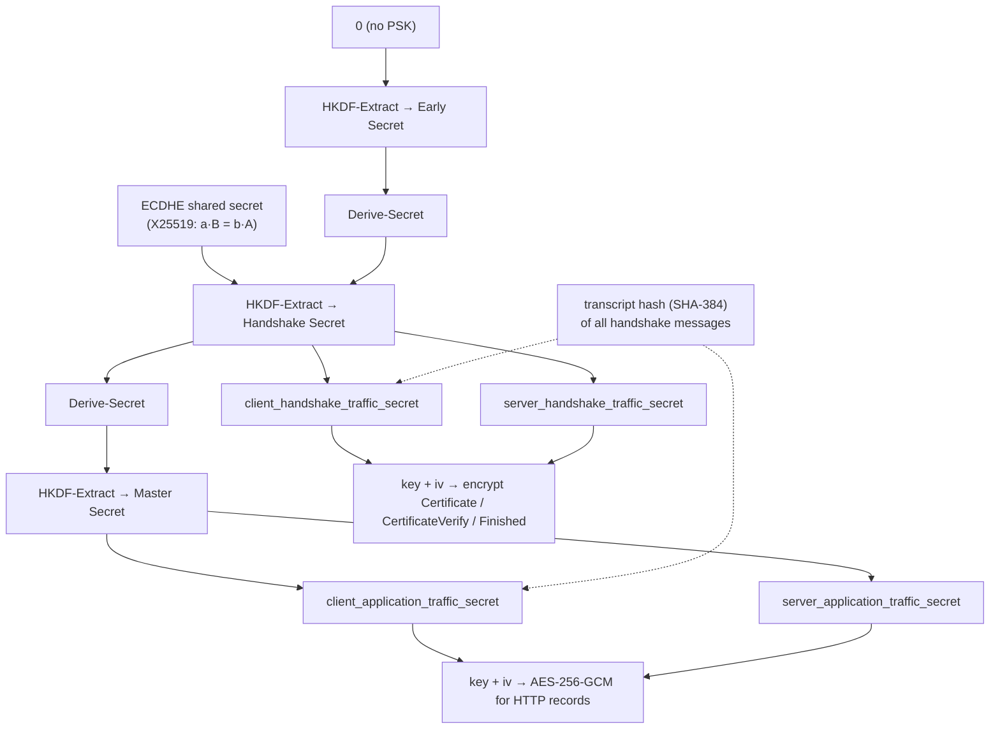

Every secret is mixed with the **transcript hash**, so keys are bound to the exact handshake
that produced them — altering any message changes all keys.

<a id="tls-alerts"></a>
### <span style="color:hsl(0,70%,60%)">9.7 TLS alerts and what they mean</span>

| Situation | Alert | What you see |
|---|---|---|
| Client sends no cert to producer | TLS 1.3: `certificate_required` (116) · TLS 1.2: `bad_certificate` (42) | `curl: (56) … tlsv13 alert certificate required` · Java `SSLHandshakeException` → consumer `502` |
| Client cert not signed by the demo CA (e.g. self-signed rogue) | `certificate_unknown` (46), JSSE's alert for any PKIX failure | `curl: (56) … alert certificate unknown` |
| Consumer truststore lacks producer's CA | consumer aborts with `certificate_unknown` (46) | `(certificate_unknown) PKIX path building failed … unable to find valid certification path to requested target` → `502` |
| Host not in SAN | client aborts | `No subject alternative names matching IP address …` / `No name matching … found` |
| Expired cert | `certificate_expired` (45) | `CertificateExpiredException` |
| TLS 1.1 offered | `protocol_version` (70) | `tlsv1 alert protocol version` |
| Tampered record | `bad_record_mac` (20) | connection reset |
| CA-trusted cert, CN not allow-listed | *(no alert — TLS succeeded)* | HTTP `403` |

<a id="authn-vs-authz"></a>
## <span style="color:hsl(120,60%,45%)">10. 🧷 Authentication vs authorization</span>

mTLS answers **"who are you?"** (authentication). It does **not** answer **"may you do this?"**
(authorization). Any cert signed by the CA passes TLS, so the producer adds a second gate.

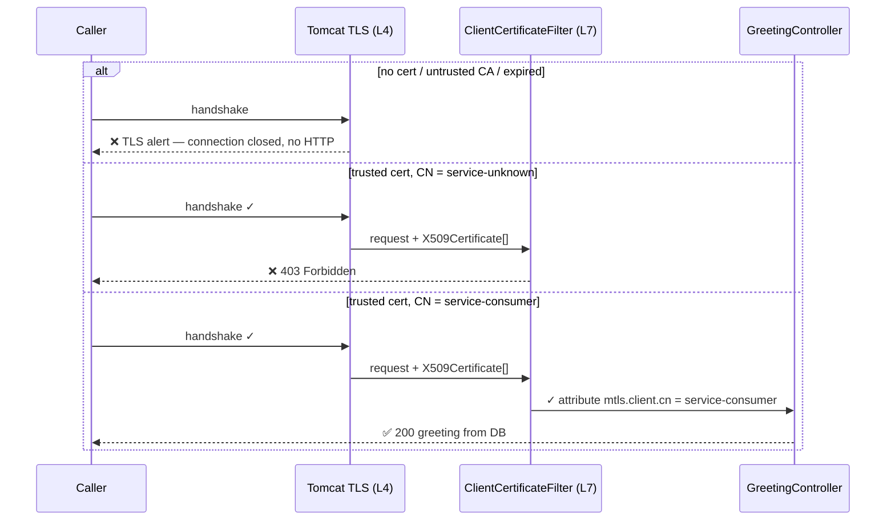

| Layer | Mechanism | Config | Failure |
|---|---|---|---|
| Authentication (TLS) | Path validation against truststore | `server.ssl.client-auth: need`, truststore | Handshake alert |
| Authorization (HTTP) | CN extracted via `LdapName` from `jakarta.servlet.request.X509Certificate` | `mtls.allowed-client-cns` | `403` |

<a id="spring-ssl-wiring"></a>
## <span style="color:hsl(30,80%,55%)">11. 🌱 How Spring Boot wires TLS (SSL bundles → JSSE)</span>

Java's TLS implementation is **JSSE** (`javax.net.ssl`). Spring Boot's **SSL bundles** load the
stores once and hand a ready `SSLContext` to both the embedded server and HTTP clients.

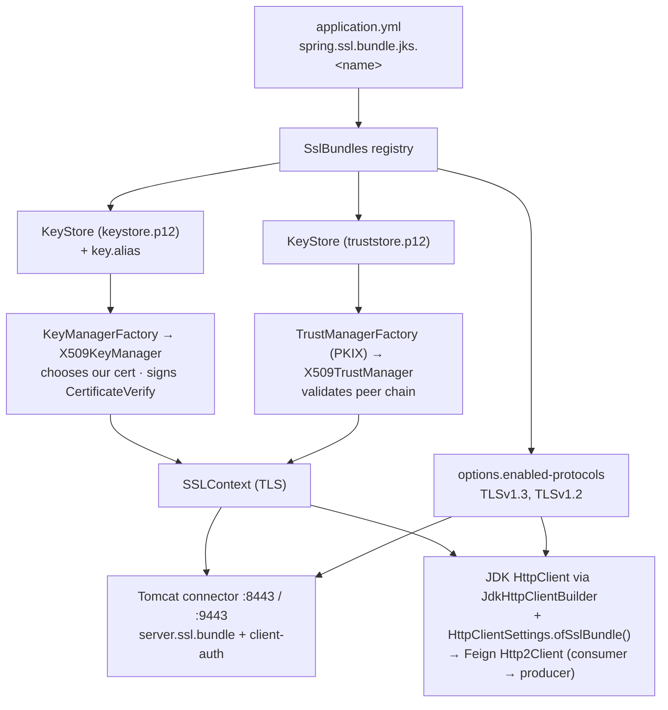

Startup of `service-consumer`, which uses the bundle on both sides:

```mermaid
sequenceDiagram
    participant Boot as Spring Boot startup (consumer)
    participant Reg as SslBundles
    participant Tom as Tomcat
    participant FC as ProducerFeignConfiguration<br/>(Feign context of ProducerClient)
    Boot->>Reg: bind spring.ssl.bundle.jks.* → load PKCS12 stores (password → PBKDF2 → decrypt)
    Boot->>Tom: server.ssl.bundle=service-consumer → SSLContext (client-auth none)
    Tom->>Tom: listen https :9443
    Boot->>FC: @EnableFeignClients → build the ProducerClient proxy
    FC->>Reg: getBundle("service-consumer")
    FC->>FC: HttpClientSettings.ofSslBundle(bundle).withConnectTimeout(5s)
    FC->>FC: JdkHttpClientBuilder.build(settings) → JDK HttpClient with SSLContext → Feign Http2Client
```

`service-producer` starts the same way with bundle `service-producer`, `client-auth=need` and port
`:8443`. It creates no Feign client. Spring Cloud OpenFeign itself has no SSL-bundle support, so the
consumer supplies its own `feign.Client` ([consumer README](service-consumer/README.md#how-the-consumer-does-mutual-tls)).

| Config | Effect |
|---|---|
| `spring.ssl.bundle.jks.<n>.keystore.location/password/type` | Load identity store |
| `spring.ssl.bundle.jks.<n>.key.alias` | Which PrivateKeyEntry to use |
| `spring.ssl.bundle.jks.<n>.truststore.*` | Load trust anchors |
| `spring.ssl.bundle.jks.<n>.options.enabled-protocols` | Restrict TLS versions |
| `server.ssl.bundle` | Server uses this bundle |
| `server.ssl.client-auth` | `none` / `want` (ask, don't require) / **`need`** (require) |

<a id="secrets-at-rest"></a>
## <span style="color:hsl(240,80%,65%)">12. 🔑 Secrets at rest — Jasypt `ENC(...)`</span>

The producer's DB password is stored as `ENC(<base64>)` in `application.yml` and decrypted in
memory at startup with a master key from `JASYPT_ENCRYPTOR_PASSWORD`. Algorithm
`PBEWITHHMACSHA512ANDAES_256` = **PBKDF2-HMAC-SHA512 (1000 it.) → AES-256-CBC**.

```mermaid
flowchart LR
    subgraph encrypt ["Encrypt (once, by developer)"]
        P1["mtls_s3cret"] --> A1["AES-256-CBC"]
        MK1["master key"] --> K1["PBKDF2-HMAC-SHA512<br/>1000 it."]
        S1["random salt 16 B"] --> K1 --> A1
        IV1["random IV 16 B"] --> A1
        A1 --> OUT["Base64(salt ‖ IV ‖ ciphertext)<br/>→ ENC(NO0t…ZYC)"]
    end
    subgraph decrypt ["Decrypt (every startup)"]
        IN["ENC(NO0t…ZYC)"] --> SPLIT["Base64-decode → 48 B<br/>salt 16 · IV 16 · ct 16"]
        MK2["JASYPT_ENCRYPTOR_PASSWORD"] --> K2["PBKDF2 (same salt)"]
        SPLIT --> K2 --> A2["AES-256-CBC decrypt"]
        SPLIT --> A2 --> PT["mtls_s3cret → HikariCP"]
    end
```

```mermaid
sequenceDiagram
    participant Boot as Spring Boot
    participant J as Jasypt BeanFactoryPostProcessor
    participant Env as Environment
    participant DS as DataSourceProperties / HikariCP
    Boot->>J: before any bean is created
    J->>Env: wrap every PropertySource (EncryptablePropertySourceWrapper)
    DS->>Env: getProperty("spring.datasource.password")
    Env->>Env: detector: starts with "ENC(" ends with ")"?
    Env->>Env: StringEncryptor.decrypt(payload)
    Env-->>DS: "mtls_s3cret" (memory only, cached)
    DS->>DS: open JDBC pool → Flyway → app ready
```

Full details — ciphertext byte layout, salt vs IV, encrypt/decrypt CLI, rotation and
troubleshooting — are in the [producer README](service-producer/README.md#encrypted-db-password).
If `JASYPT_ENCRYPTOR_PASSWORD` is unset **or** wrong, startup aborts with the same
`Failed to bind properties under 'spring.datasource.password'` error; see
[troubleshooting](service-producer/README.md#jasypt-troubleshooting).

| Protects | Doesn't protect |
|---|---|
| Password in git, CI logs, container images, config dumps | Attacker who also has the master key |
| Cheap offline guessing (salt + iterations) | Heap dump of the running JVM |

<a id="inspecting-the-material"></a>
## <span style="color:hsl(193,80%,58%)">13. 🔍 Inspecting and debugging</span>

```bash
# certificate details (subject, issuer, SAN, EKU, validity)
openssl x509 -in certs/out/service-producer.crt -noout -text

# verify a leaf chains to the CA
openssl verify -CAfile certs/out/ca.crt certs/out/service-consumer.crt

# list store entries (PrivateKeyEntry vs trustedCertEntry)
keytool -list -v -keystore service-producer/src/main/resources/ssl/service-producer-keystore.p12 -storepass changeit
keytool -list -v -keystore service-producer/src/main/resources/ssl/truststore.p12 -storepass changeit

# how a .p12 is protected (PBES2 / PBKDF2 / AES-256-CBC / MAC)
openssl pkcs12 -info -noout -in service-producer/src/main/resources/ssl/service-producer-keystore.p12 -passin pass:changeit

# watch a real mTLS handshake: protocol, cipher, key share, requested CA names
openssl s_client -connect localhost:8443 -CAfile certs/out/ca.crt \
  -cert certs/out/service-consumer.crt -key certs/out/service-consumer.key </dev/null

# force TLS 1.2 / prove TLS 1.1 is refused
openssl s_client -tls1_2 -connect localhost:8443 -CAfile certs/out/ca.crt \
  -cert certs/out/service-consumer.crt -key certs/out/service-consumer.key </dev/null
openssl s_client -tls1_1 -cipher 'DEFAULT@SECLEVEL=0' -connect localhost:8443 </dev/null

# JSSE handshake trace from the Java side
java -Djavax.net.debug=ssl:handshake -jar service-consumer/target/service-consumer-0.0.1-SNAPSHOT.jar
```

<a id="production-hardening"></a>
## <span style="color:hsl(0,75%,60%)">14. 🏭 Production hardening checklist</span>

| Area | Demo | Production |
|---|---|---|
| CA | Self-signed root, key on disk | Offline root + online intermediate; HSM/KMS-backed (Vault PKI, AWS Private CA, cert-manager) |
| Cert lifetime | 825 days | Hours–days, automated rotation (SPIFFE/SPIRE, cert-manager) |
| Revocation | None | Short-lived certs or OCSP stapling |
| Stores | Committed `.p12`, password `changeit` | Mounted from secret manager (`SSL_KEYSTORE_LOCATION=file:/…`), strong passwords |
| Hot reload | Off (classpath stores) | File-based stores + `spring.ssl.bundle.jks.*.reload-on-update: true` |
| Protocols | TLS 1.3 + 1.2 | TLS 1.3 only if all peers support it |
| Authorization | CN allow-list filter | Spring Security `x509()` → roles, or SPIFFE IDs in SAN URI |
| Jasypt master key | Documented demo value | Injected from secret store; rotate; or replace with Vault/KMS-managed secrets |
| Inbound to consumer | One-way TLS | mTLS or OAuth2 at the edge |

<a id="glossary"></a>
## <span style="color:hsl(260,60%,65%)">15. 📖 Glossary</span>

| Term | Meaning |
|---|---|
| **AEAD** | Authenticated Encryption with Associated Data — encrypt + integrity-protect in one operation (AES-GCM) |
| **AES** | Advanced Encryption Standard — 128-bit block symmetric cipher |
| **CA** | Certificate Authority — signs certificates |
| **CBC** | Cipher Block Chaining — block cipher mode needing an IV and padding |
| **CN** | Common Name — attribute in a certificate subject |
| **CSR** | Certificate Signing Request (PKCS#10) |
| **CSPRNG** | Cryptographically Secure Pseudo-Random Number Generator |
| **ECDHE** | Elliptic-Curve Diffie-Hellman Ephemeral — key agreement with fresh keys per session |
| **EKU** | Extended Key Usage — `serverAuth`, `clientAuth`, … |
| **Forward secrecy** | Compromise of long-term keys doesn't expose past sessions |
| **GCM** | Galois/Counter Mode — AEAD mode for AES |
| **HKDF** | HMAC-based Key Derivation Function (TLS 1.3 key schedule) |
| **HMAC** | Hash-based Message Authentication Code |
| **IV** | Initialisation Vector — random, public per-encryption input for CBC |
| **JSSE** | Java Secure Socket Extension — Java's TLS implementation |
| **KDF** | Key Derivation Function |
| **mTLS** | Mutual TLS — both client and server present certificates |
| **Nonce** | Number used once — must never repeat under the same key |
| **OCSP / CRL** | Online status check / list of revoked certificates |
| **PBE / PBES2 / PBKDF2** | Password-Based Encryption scheme / its v2 scheme / its key-derivation function (PKCS#5) |
| **PEM / DER** | Base64 text / binary encodings of ASN.1 structures |
| **PKCS#8 / #10 / #12** | Private-key format / CSR format / keystore container |
| **PKI** | Public Key Infrastructure |
| **PKIX** | X.509 path-validation profile (RFC 5280) |
| **PSS** | Probabilistic Signature Scheme — randomized RSA signature padding |
| **RSA** | Rivest-Shamir-Adleman public-key algorithm |
| **Salt** | Random, public input to a KDF so equal passwords give different keys |
| **SAN** | Subject Alternative Name — hostnames/IPs a cert is valid for |
| **SHA-2** | SHA-256/384/512 hash family |
| **SSL bundle** | Spring Boot abstraction grouping keystore + truststore + options |
| **Truststore / keystore** | Store of trusted CA certs / store of own private key + cert |
| **X25519** | ECDH on Curve25519 |
| **X.509** | Certificate format standard |

<a id="quick-start"></a>
## <span style="color:hsl(120,60%,45%)">16. 🚀 Quick start</span>

| Prerequisite | Why |
|---|---|
| JDK 25+ | `maven.compiler.release` is 25 (from super-pom) |
| Maven 3.9+ | Enforced by super-pom |
| `com.org.llm:super-pom:1.0.0` in `~/.m2` | Parent POM; not on Maven Central (section 3) |
| Docker | PostgreSQL via `docker compose`; Testcontainers during the build's tests |
| `curl`, OpenSSL, `keytool` (ships with the JDK) | Calling the services; PEM extraction; cert scripts |

```bash
# 1. PostgreSQL 19 on :5434
docker compose up -d --wait

# 2. Build + test (the Testcontainers integration test needs Docker; add -DskipTests to skip it)
mvn clean package

# 3. PEM files for curl. certs/out/ is git-ignored, so a fresh clone has none.
#    Extract them from the committed stores (the stores are left untouched):
mkdir -p certs/out
keytool -exportcert -rfc -alias mtls-demo-ca -storepass changeit \
  -keystore service-consumer/src/main/resources/ssl/truststore.p12 -file certs/out/ca.crt
openssl pkcs12 -passin pass:changeit -clcerts -nokeys \
  -in service-consumer/src/main/resources/ssl/service-consumer-keystore.p12 -out certs/out/service-consumer.crt
openssl pkcs12 -passin pass:changeit -nocerts -nodes \
  -in service-consumer/src/main/resources/ssl/service-consumer-keystore.p12 -out certs/out/service-consumer.key
openssl pkcs12 -passin pass:changeit -clcerts -nokeys \
  -in service-producer/src/test/resources/ssl/service-unknown-keystore.p12 -out certs/out/service-unknown.crt
openssl pkcs12 -passin pass:changeit -nocerts -nodes \
  -in service-producer/src/test/resources/ssl/service-unknown-keystore.p12 -out certs/out/service-unknown.key

# 4. Run: one terminal each, from the repo root
cd service-producer && JASYPT_ENCRYPTOR_PASSWORD=mtls-demo-master-key mvn spring-boot:run
cd service-consumer && mvn spring-boot:run

# 5. Call the consumer; it calls the producer over mTLS
curl --cacert certs/out/ca.crt "https://localhost:9443/api/v1/hello/himansu?lang=fr"
# {"consumer":"service-consumer","upstream":{"message":"Bonjour, himansu !","language":"fr",
#  "servedBy":"service-producer","callerCn":"service-consumer","timestamp":"…"}}

# 6. Stop PostgreSQL when done (add -v to also delete the database volume)
docker compose down
```

- **Running from an IDE:** add `JASYPT_ENCRYPTOR_PASSWORD=mtls-demo-master-key` to the
  `ProducerApplication` run configuration's environment variables. Without it, startup fails with
  `Failed to bind properties under 'spring.datasource.password'`.
- Instead of step 3 you can run both generate scripts (section 4). That also fills `insomnia-certs`,
  but it creates a new CA and re-issues every committed store.
- The extracted PEMs include no `ca.key`. If you run a generate script later, it creates a new CA,
  so run **both** scripts.
- More calls to try (`403`, `404`, handshake failure) are in the
  [producer README](service-producer/README.md#running-locally), or in the
  [Insomnia collection](#insomnia). In Insomnia, add `insomnia-certs/ca.crt` as the CA certificate
  **before** sending anything ([18.2](#insomnia-ca-certificate)).

<a id="maven-commands"></a>
## <span style="color:hsl(30,80%,55%)">17. 🔨 Maven commands</span>

| Command | What it does |
|---|---|
| `mvn verify` | Build both modules, run unit + Testcontainers integration tests (Docker required) |
| `mvn package -DskipTests` | Build the jars only; no Docker needed |
| `JASYPT_ENCRYPTOR_PASSWORD=mtls-demo-master-key mvn -pl service-producer spring-boot:run` | Run the producer from the repo root |
| `mvn -pl service-consumer spring-boot:run` | Run the consumer from the repo root |
| `mvn -Psecurity-scan verify` | OWASP dependency check (profile from super-pom; reads `NVD_API_KEY`, which dependency-check strongly recommends setting) |
| `mvn -Pmutation-test test` | PIT mutation testing (profile from super-pom) |

`MtlsIntegrationTest` ends in `Test`, so Surefire runs it in the `test` phase. That means
`mvn test` and `mvn package` need Docker too, unless you pass `-DskipTests`.

<a id="insomnia"></a>
## <span style="color:hsl(275,80%,58%)">18. 🧪 Insomnia collection</span>

Insomnia never imports certificates. Its importer only carries workspaces, folders, requests and
environments. So after importing, set up the certificates **once**, before calling any API.
Otherwise every request fails TLS verification.

```mermaid
flowchart LR
    A["18.1 Import<br/>insomnia-collection.json"] --> B["18.2 Add CA certificate<br/>insomnia-certs/ca.crt"]
    B --> C["18.3 Add client certificates<br/>localhost:8443 · 127.0.0.1:8443"]
    C --> D["Send requests"]
    B -. "enough for the<br/>consumer folder" .-> D
```

<a id="insomnia-import"></a>
### <span style="color:hsl(20,80%,58%)">18.1 Import the collection</span>

In Insomnia, choose **Import** and pick [`insomnia-collection.json`](insomnia-collection.json) from the
repo root. It creates the **learning-mtls** collection with a *Base Environment* (`consumerUrl`,
`producerUrl`, `producerUrlAsUnknown`) and four folders ([18.4](#insomnia-folders)).

<a id="insomnia-ca-certificate"></a>
### <span style="color:hsl(80,80%,50%)">18.2 Add the CA certificate — before calling any API</span>

Both services use certificates signed by the private **mTLS Demo Root CA**. Insomnia doesn't
trust that CA, so without it every request fails with
`SSL peer certificate or SSH remote key was not OK`.

The CA certificate is [`insomnia-certs/ca.crt`](insomnia-certs/ca.crt). It is public and contains
no private key.

1. Open the **learning-mtls** collection.
2. In the sidebar, click **Certificates** (next to *Cookies*). This opens *Manage Certificates*.
3. Click **Add CA Certificate** and select `<repo>/insomnia-certs/ca.crt`.
4. Make sure the CA certificate is **enabled**.
5. Test it: start the consumer and send **GET — Consumer Health**. You should get `200`.

Check that the file matches the CA in the committed truststores. The two SHA-256 fingerprints must
be identical (`FB:4D:48:…:9D:AD` for the committed demo CA):

```bash
openssl x509 -in insomnia-certs/ca.crt -noout -fingerprint -sha256
keytool -list -v -storepass changeit \
  -keystore service-consumer/src/main/resources/ssl/truststore.p12 | grep SHA256
```

If the file is missing, or the CA was regenerated with the scripts in section 4, export it again
from a truststore:

```bash
mkdir -p insomnia-certs
keytool -exportcert -rfc -alias mtls-demo-ca -storepass changeit \
  -keystore service-consumer/src/main/resources/ssl/truststore.p12 -file insomnia-certs/ca.crt
```

The CA certificate alone is enough for the *service-consumer* folder: `:9443` doesn't ask for a
client certificate. The producer on `:8443` also needs 18.3.

<a id="insomnia-client-certificates"></a>
### <span style="color:hsl(300,70%,60%)">18.3 Add the client certificates — producer calls</span>

In the same *Manage Certificates* dialog, click **Add Client Certificate** twice:

| Host | Tab **PFX or PKCS12** — file | Passphrase | Acts as |
|---|---|---|---|
| `localhost:8443` | `<repo>/service-consumer/src/main/resources/ssl/service-consumer-keystore.p12` | `changeit` | `CN=service-consumer`: allowed |
| `127.0.0.1:8443` | `<repo>/service-producer/src/test/resources/ssl/service-unknown-keystore.p12` | `changeit` | `CN=service-unknown`: trusted CA, not allow-listed |

Insomnia picks the client certificate by host, and the producer's certificate is valid for both
`localhost` and `127.0.0.1` (SAN). So one running producer shows both outcomes: allowed via
`localhost`, forbidden via `127.0.0.1`. Insomnia's libcurl uses OpenSSL 3.5, which reads the
committed PKCS#12 stores directly, so client certificates need no PEM conversion.

<a id="insomnia-folders"></a>
### <span style="color:hsl(165,80%,45%)">18.4 Folders and expected results</span>

| Folder | Host | Client certificate | Shows |
|---|---|---|---|
| service-consumer — one-way TLS | `localhost:9443` | none needed | `200` with `upstream.callerCn`, upstream `404`, actuator |
| service-producer — mTLS as service-consumer | `localhost:8443` | `service-consumer-keystore.p12` | `200`, `404` problem detail, actuator |
| service-producer — mTLS as service-unknown | `127.0.0.1:8443` | `service-unknown-keystore.p12` | `403` (health `200`, info `403`) |
| service-producer — no client certificate | `localhost:8443` | disable it first | TLS alert `certificate_required` |

<a id="insomnia-troubleshooting"></a>
### <span style="color:hsl(0,70%,60%)">18.5 Troubleshooting</span>

| Insomnia error | Cause | Fix |
|---|---|---|
| `SSL peer certificate or SSH remote key was not OK` | No CA certificate, disabled, or a different CA (curl error 60) | 18.2: add `insomnia-certs/ca.crt`, enable it, compare fingerprints |
| `Failure when receiving data from the peer` on `:8443` | No client certificate matched the host, so the producer aborted the handshake with `certificate_required` (curl 56) | 18.3: add the client certificate for exactly `localhost:8443` / `127.0.0.1:8443` |
| `Problem with the local SSL certificate` | Wrong passphrase or path for the `.p12` file (curl 58) | Passphrase is `changeit`; re-select the file |
| `Couldn't connect to server` | Service not running (curl 7) | Start the producer (`:8443`) / consumer (`:9443`) |
| `403` from the producer via `localhost` | The `localhost:8443` entry points at the wrong `.p12` | Use `service-consumer-keystore.p12` for `localhost:8443` |
