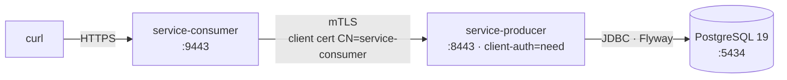
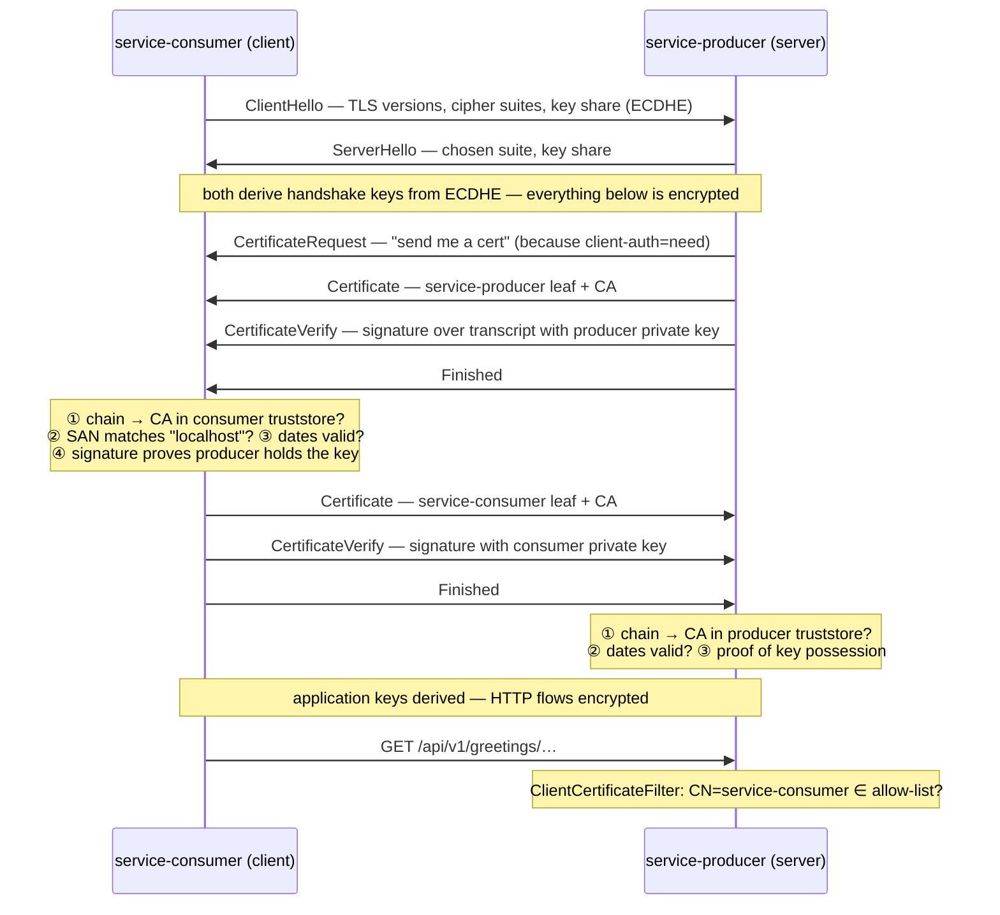

# <span style="color:hsl(55,80%,50%)">learning-mtls — Mutual TLS between Spring Boot services</span>

## <span style="color:hsl(141,80%,58%)">Table of contents</span>

1. 🎯 [Overview](#overview)
2. 🧩 [Modules](#modules)
3. 🏗️ [Maven structure](#maven-structure)
4. 🔑 [Certificates and generate scripts](#certificates)
5. 📚 [PKI & TLS concepts](#pki-and-tls-concepts)
    - 5.1 [Keys, certificates and CAs](#keys-certificates-and-cas)
    - 5.2 [X.509 certificate anatomy](#x509-certificate-anatomy)
    - 5.3 [Keystore vs truststore](#keystore-vs-truststore)
    - 5.4 [File formats — PEM, DER, PKCS#1/#8/#10/#12, JKS](#file-formats)
    - 5.5 [The mTLS handshake step by step](#the-mtls-handshake)
    - 5.6 [What each script command does](#what-each-script-command-does)
    - 5.7 [Inspecting the material](#inspecting-the-material)
6. 🚀 [Quick start](#quick-start)
7. 🔨 [Maven commands](#maven-commands)

<a id="overview"></a>
## <span style="color:hsl(278,80%,58%)">1. 🎯 Overview</span>

Two Spring Boot 4.1 services that talk over **HTTPS with mutual TLS**: each side proves its
identity with an X.509 certificate issued by a private demo CA, and each side validates the
other's certificate.



<a id="modules"></a>
## <span style="color:hsl(193,80%,58%)">2. 🧩 Modules</span>

| Module | Role | Docs |
|---|---|---|
| [`service-producer`](service-producer) | mTLS server; reads greetings from PostgreSQL; CN allow-list; Jasypt-encrypted DB password | [README](service-producer/README.md) |
| [`service-consumer`](service-consumer) | mTLS client; calls the producer with its client cert via `RestClient` + SSL bundle | [README](service-consumer/README.md) |
| `docker-compose.yml` | PostgreSQL `19beta3` for the producer (host port 5434) | — |
| `certs/out/` (git-ignored) | Shared root CA (`ca.key`, `ca.crt`) + PEM copies, written by the generate scripts | — |

<a id="maven-structure"></a>
## <span style="color:hsl(331,80%,58%)">3. 🏗️ Maven structure</span>

```
com.org.llm:super-pom:1.0.0          (Spring Boot 4.1.0 parent, learning-bom, plugins, enforcer)
└── com.org.mtls:learning-mtls        (this aggregator — shared deps: webmvc, actuator, Lombok, DevTools)
    ├── service-producer
    └── service-consumer
```

<a id="certificates"></a>
## <span style="color:hsl(56,80%,50%)">4. 🔑 Certificates and generate scripts</span>

Each module owns a script next to its stores:

| Script | Writes |
|---|---|
| `service-producer/src/main/resources/ssl/generate-certs.sh` | `main/…/ssl/service-producer-keystore.p12`, `main/…/ssl/truststore.p12`, `test/…/ssl/service-consumer-keystore.p12`, `test/…/ssl/service-unknown-keystore.p12` |
| `service-consumer/src/main/resources/ssl/generate-certs.sh` | `main/…/ssl/service-consumer-keystore.p12`, `main/…/ssl/truststore.p12` |

Both sign with the **same root CA** in `certs/out/`. Whichever script runs first creates it;
the other reuses it. If the CA is ever recreated, run **both** scripts so both truststores
contain the new CA. Scripts are excluded from the jars (`maven-jar-plugin`).

```bash
service-consumer/src/main/resources/ssl/generate-certs.sh
service-producer/src/main/resources/ssl/generate-certs.sh
```

The committed `.p12` files are demo material so the project runs out of the box; `ca.key`
is never committed.

<a id="pki-and-tls-concepts"></a>
## <span style="color:hsl(200,80%,55%)">5. 📚 PKI & TLS concepts</span>

<a id="keys-certificates-and-cas"></a>
### <span style="color:hsl(20,80%,58%)">5.1 Keys, certificates and CAs</span>

| Term | What it is | In this project |
|---|---|---|
| **Key pair** | Asymmetric pair: a **private key** (secret, signs / decrypts) and its **public key** (shared, verifies / encrypts). Knowing the public key does not reveal the private key. | RSA-2048 per service, RSA-4096 for the CA |
| **Certificate** | A signed statement: *"this public key belongs to this identity, for these purposes, until this date"*. | `service-producer.crt`, `service-consumer.crt`, … |
| **CA** (Certificate Authority) | An entity whose signature others agree to trust. It signs certificates with its private key. | `mTLS Demo Root CA` — self-signed |
| **Root CA** | A CA whose certificate is **self-signed** (issuer = subject). Trust in it is configured, not proven. | `ca.crt` — placed in both truststores |
| **Chain of trust** | Leaf cert → (intermediates) → root. Each link's signature is verified with the issuer's public key. | Leaf → root (no intermediate) |
| **CSR** (Certificate Signing Request, PKCS#10) | The applicant's public key + requested subject, signed with its private key to prove possession. The CA turns it into a certificate. | `*.csr`, deleted after signing |
| **Signature** | CA hashes the certificate body (SHA-256) and signs the hash with its private key. Anyone with the CA public key can verify it wasn't altered. | `sha256WithRSAEncryption` |
| **mTLS** (mutual TLS) | Normal TLS authenticates only the server; mTLS makes the **client** present a certificate too, so both sides authenticate. | producer `client-auth: need` |

<a id="x509-certificate-anatomy"></a>
### <span style="color:hsl(80,80%,50%)">5.2 X.509 certificate anatomy</span>

`openssl x509 -in certs/out/service-producer.crt -noout -text` shows:

| Field / extension | Meaning | Value in our leaf certs |
|---|---|---|
| **Version** | X.509 v3 (supports extensions) | 3 |
| **Serial number** | Unique per CA; used for revocation | random |
| **Signature algorithm** | How the CA signed | `sha256WithRSAEncryption` |
| **Issuer** | Who signed | `CN=mTLS Demo Root CA, O=com.org` |
| **Validity** (`notBefore` / `notAfter`) | Lifetime; expired certs fail the handshake | 825 days (CA: 3650) |
| **Subject** | Who the cert identifies | `CN=service-producer, O=com.org` |
| **Subject Public Key Info** | The public key | RSA 2048 |
| `basicConstraints` *(critical)* | Is this a CA? | `CA:FALSE` — a leaf can't sign other certs |
| `keyUsage` *(critical)* | Low-level key operations allowed | `digitalSignature, keyEncipherment` |
| `extendedKeyUsage` | Protocol roles allowed | `serverAuth, clientAuth` — same cert works as server *and* client |
| `subjectAltName` (SAN) | Host names / IPs the cert is valid for; **hostname verification uses SAN, not CN** | `DNS:service-producer, DNS:localhost, IP:127.0.0.1` |

The CA cert has `basicConstraints=CA:TRUE` and `keyUsage=keyCertSign,cRLSign`.

> **CN vs SAN** — TLS clients match the URL host against the **SAN** (that's why
> `https://localhost:8443` works). The producer's authorization filter reads the **CN** to
> decide *which service* is calling. Two different jobs, two different fields.

<a id="keystore-vs-truststore"></a>
### <span style="color:hsl(300,70%,60%)">5.3 Keystore vs truststore</span>

Both are the same file format (PKCS#12 here); what differs is **what you put in them** and
**how they're used**.

| | Keystore | Truststore |
|---|---|---|
| Answers | *"Who am I?"* | *"Whom do I trust?"* |
| Contains | **PrivateKeyEntry**: own private key + own cert + chain (CA cert) | **trustedCertEntry**: CA certificate(s) only — no private keys |
| Secret? | **Yes** — anyone with it can impersonate the service | No (public certs), but protect against tampering: adding a CA = trusting it |
| Server side use | Cert sent in `Certificate` message; key signs `CertificateVerify` | Validates the client's cert chain |
| Client side use | Cert sent when server sends `CertificateRequest`; key signs `CertificateVerify` | Validates the server's cert chain |
| Spring Boot | `spring.ssl.bundle.jks.<name>.keystore.*` (+ `key.alias`) | `spring.ssl.bundle.jks.<name>.truststore.*` |

| File | Type | Entries |
|---|---|---|
| `service-producer-keystore.p12` | keystore | alias `service-producer` → key + leaf cert + CA cert |
| `service-consumer-keystore.p12` | keystore | alias `service-consumer` → key + leaf cert + CA cert |
| `truststore.p12` (each module) | truststore | alias `mtls-demo-ca` → CA cert |

A **Spring Boot SSL bundle** groups one keystore + one truststore + protocol options under a
name (`service-producer`, `service-consumer`) so the server (`server.ssl.bundle`) and HTTP
clients can reference the pair by name.

<a id="file-formats"></a>
### <span style="color:hsl(165,80%,45%)">5.4 File formats — PEM, DER, PKCS#1/#8/#10/#12, JKS</span>

| Name | What it is | Where you meet it here |
|---|---|---|
| **ASN.1** | Abstract syntax all of these structures are defined in | — |
| **DER** | Binary encoding of ASN.1 | inside everything below |
| **PEM** | Base64(DER) between `-----BEGIN …-----` / `-----END …-----` lines — text, copy-paste friendly | `certs/out/*.crt`, `*.key` (used by `curl`) |
| **PKCS#1** | RSA-specific key format (`BEGIN RSA PRIVATE KEY`) | — |
| **PKCS#8** | Algorithm-agnostic private key format (`BEGIN PRIVATE KEY`) | `*.key` from `openssl req -newkey` |
| **PKCS#10** | Certificate Signing Request (`BEGIN CERTIFICATE REQUEST`) | `*.csr` (temporary) |
| **PKCS#5 / PBKDF2** | Password-based key derivation — protects the contents of a `.p12`; Jasypt uses the same idea for `ENC(...)` | `.p12` password `changeit` |
| **PKCS#12** (`.p12` / `.pfx`) | Password-protected container bundling private keys + cert chains + trusted certs. Industry standard; default keystore type since Java 9 | all `*.p12` |
| **JKS** | Legacy Java-only keystore format | not used (Spring's `jks` bundle prefix supports both JKS and PKCS12 via `type`) |

<a id="the-mtls-handshake"></a>
### <span style="color:hsl(45,80%,50%)">5.5 The mTLS handshake step by step (TLS 1.3)</span>



Key points:

- **Certificates prove identity only together with `CertificateVerify`.** A certificate is
  public; the signature over the handshake transcript proves the sender owns the private key.
- **ECDHE** gives *forward secrecy*: session keys are ephemeral, so a stolen private key can't
  decrypt previously recorded traffic. The RSA keys are used only for signatures.
- Any failure in ①–④ aborts the handshake with a TLS alert (`bad_certificate`,
  `certificate_unknown`, `unknown_ca`) — the HTTP request is never sent.

<a id="what-each-script-command-does"></a>
### <span style="color:hsl(0,70%,60%)">5.6 What each script command does</span>

| Command | Purpose |
|---|---|
| `openssl req -x509 -newkey rsa:4096 … -keyout ca.key -out ca.crt -addext basicConstraints=critical,CA:TRUE …` | Create the CA key pair and a **self-signed** root certificate in one step (only if `ca.key` doesn't exist) |
| `openssl req -newkey rsa:2048 -nodes -keyout <svc>.key -out <svc>.csr -subj "/CN=<svc>/O=com.org"` | Create a service key pair and a CSR (`-nodes` = don't encrypt the PEM key) |
| `openssl x509 -req -in <svc>.csr -CA ca.crt -CAkey ca.key -extfile <svc>.ext -out <svc>.crt` | CA signs the CSR, adding the extensions from `<svc>.ext` (SAN, EKU, keyUsage, basicConstraints) |
| `openssl pkcs12 -export -name <svc> -inkey <svc>.key -in <svc>.crt -certfile ca.crt -out <svc>-keystore.p12` | Bundle key + leaf + CA chain into a password-protected **keystore**; `-name` becomes the alias Spring uses (`key.alias`) |
| `keytool -importcert -alias mtls-demo-ca -file ca.crt -keystore truststore.p12 -storetype PKCS12` | Create a **truststore** holding only the CA cert as a `trustedCertEntry` |

<a id="inspecting-the-material"></a>
### <span style="color:hsl(260,60%,65%)">5.7 Inspecting the material</span>

```bash
# certificate details (subject, issuer, SAN, EKU, validity)
openssl x509 -in certs/out/service-producer.crt -noout -text

# verify a leaf chains to the CA
openssl verify -CAfile certs/out/ca.crt certs/out/service-consumer.crt

# list store entries (PrivateKeyEntry vs trustedCertEntry)
keytool -list -v -keystore service-producer/src/main/resources/ssl/service-producer-keystore.p12 -storepass changeit
keytool -list -v -keystore service-producer/src/main/resources/ssl/truststore.p12 -storepass changeit

# watch a real mTLS handshake against the producer
openssl s_client -connect localhost:8443 -CAfile certs/out/ca.crt \
  -cert certs/out/service-consumer.crt -key certs/out/service-consumer.key </dev/null
```

<a id="quick-start"></a>
## <span style="color:hsl(120,60%,45%)">6. 🚀 Quick start</span>

```bash
docker compose up -d --wait
mvn clean package

# terminal 1
cd service-producer && JASYPT_ENCRYPTOR_PASSWORD=mtls-demo-master-key mvn spring-boot:run
# terminal 2
cd service-consumer && mvn spring-boot:run

# certs/out/ca.crt is created by the generate scripts (section 4)
curl --cacert certs/out/ca.crt "https://localhost:9443/api/v1/hello/himansu?lang=fr"
```

<a id="maven-commands"></a>
## <span style="color:hsl(30,80%,55%)">7. 🔨 Maven commands</span>

| Command | What it does |
|---|---|
| `mvn verify` | Build both modules, run unit + Testcontainers integration tests (Docker required) |
| `mvn -pl service-producer spring-boot:run` | Run one module |
| `mvn -Psecurity-scan verify` | OWASP dependency check (profile from super-pom) |
| `mvn -Pmutation-test test` | PIT mutation testing (profile from super-pom) |
