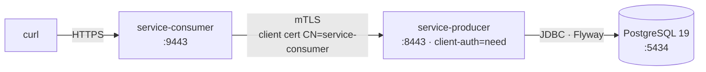

# <span style="color:hsl(55,80%,50%)">learning-mtls — Mutual TLS between Spring Boot services</span>

## <span style="color:hsl(141,80%,58%)">Table of contents</span>

1. 🎯 [Overview](#overview)
2. 🧩 [Modules](#modules)
3. 🏗️ [Maven structure](#maven-structure)
4. 🔑 [Certificates](#certificates)
5. 🚀 [Quick start](#quick-start)
6. 🔨 [Maven commands](#maven-commands)

<a id="overview"></a>
## <span style="color:hsl(278,80%,58%)">1. 🎯 Overview</span>

Two Spring Boot 4.1 services that talk over **HTTPS with mutual TLS**: each side proves its
identity with an X.509 certificate issued by a private demo CA, and each side validates the
other's certificate.



<a id="modules"></a>
## <span style="color:hsl(193,80%,58%)">2. 🧩 Modules</span>

| Module | Role | Docs |
|---|---|---|
| [`service-producer`](service-producer) | mTLS server; reads greetings from PostgreSQL; CN allow-list; Jasypt-encrypted DB password | [README](service-producer/README.md) |
| [`service-consumer`](service-consumer) | mTLS client; calls the producer with its client cert via `RestClient` + SSL bundle | [README](service-consumer/README.md) |
| [`certs`](certs) | `generate-certs.sh` — demo CA, service keystores, truststore | — |
| `docker-compose.yml` | PostgreSQL 19 for the producer | — |

<a id="maven-structure"></a>
## <span style="color:hsl(331,80%,58%)">3. 🏗️ Maven structure</span>

```
com.org.llm:super-pom:1.0.0          (Spring Boot 4.1.0 parent, learning-bom, plugins, enforcer)
└── com.org.mtls:learning-mtls        (this aggregator — shared deps: webmvc, actuator, Lombok, DevTools)
    ├── service-producer
    └── service-consumer
```

<a id="certificates"></a>
## <span style="color:hsl(56,80%,50%)">4. 🔑 Certificates</span>

`./certs/generate-certs.sh` creates a root CA and three leaf certs
(`service-producer`, `service-consumer`, `service-unknown`), each with SANs `localhost`,
`127.0.0.1` and its own name, then copies PKCS12 stores into each module's
`src/*/resources/ssl/`. The CA key and PEM files stay in `certs/out/` (git-ignored).
The committed `.p12` files are demo material only. Re-run the script to rotate everything.

<a id="quick-start"></a>
## <span style="color:hsl(200,80%,55%)">5. 🚀 Quick start</span>

```bash
docker compose up -d --wait
mvn clean package

# terminal 1
cd service-producer && JASYPT_ENCRYPTOR_PASSWORD=mtls-demo-master-key mvn spring-boot:run
# terminal 2
cd service-consumer && mvn spring-boot:run

# needs certs/out/ca.crt — run ./certs/generate-certs.sh once if missing
curl --cacert certs/out/ca.crt "https://localhost:9443/api/v1/hello/himansu?lang=fr"
```

<a id="maven-commands"></a>
## <span style="color:hsl(30,80%,55%)">6. 🔨 Maven commands</span>

| Command | What it does |
|---|---|
| `mvn verify` | Build both modules, run unit + Testcontainers integration tests (Docker required) |
| `mvn -pl service-producer spring-boot:run` | Run one module |
| `mvn -Psecurity-scan verify` | OWASP dependency check (profile from super-pom) |
| `mvn -Pmutation-test test` | PIT mutation testing (profile from super-pom) |
