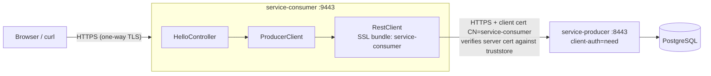

# <span style="color:hsl(200,80%,58%)">service-consumer — mTLS REST Client</span>

## <span style="color:hsl(141,80%,58%)">Table of contents</span>

1. 🧰 [Stack](#stack)
2. 🎯 [What this service does](#what-this-service-does)
3. ✨ [Features used](#features-used)
4. 🔐 [How the consumer does mutual TLS](#how-the-consumer-does-mutual-tls) — concepts: [Security, TLS & encryption](../README.md#security-goals)
5. 🌐 [API](#api)
6. 🚨 [Error mapping](#error-mapping)
7. ⚙️ [Configuration reference](#configuration-reference)
8. 🚀 [Running locally](#running-locally)
9. 🧪 [Testing](#testing)
10. 📁 [Project layout](#project-layout)
11. ⚠️ [Production notes](#production-notes)

<a id="stack"></a>
## <span style="color:hsl(278,80%,58%)">1. 🧰 Stack</span>

| Component   | Version / Detail                                            |
|-------------|-------------------------------------------------------------|
| Java        | 25 (`maven.compiler.release` from super-pom; needs JDK 25+) |
| Spring Boot | 4.1.0 (via `learning-mtls` → `super-pom`)                   |
| Web         | Spring MVC on embedded Tomcat, HTTPS (port `9443`)          |
| HTTP client | Spring `RestClient` + JDK `HttpClient` (auto-detected)      |
| JSON        | Jackson 3 (`tools.jackson`, the Spring Boot 4 default)      |
| TLS         | Spring Boot SSL bundles, PKCS12, TLS 1.3 / 1.2              |
| Boilerplate | Lombok + Java records                                       |
| Dev loop    | Spring Boot DevTools (auto-restart)                         |
| Tests       | JUnit Jupiter 6, `@WebMvcTest`, Mockito                     |
| Build       | Maven 3.9+                                                  |

<a id="what-this-service-does"></a>
## <span style="color:hsl(56,80%,50%)">2. 🎯 What this service does</span>

`service-consumer` is the **client side** of the mTLS pair. It exposes
`GET /api/v1/hello/{name}` and, for each request, calls
[`service-producer`](../service-producer/README.md) over HTTPS, presenting its own client
certificate and validating the producer's server certificate.



Both sides validate each other:

| Direction | Who validates | Against |
|---|---|---|
| consumer → producer server cert | consumer's `RestClient` | `ssl/truststore.p12` (demo root CA) + hostname (`localhost` SAN) |
| producer ← consumer client cert | producer's Tomcat + CN filter | producer truststore + `mtls.allowed-client-cns` |

<a id="features-used"></a>
## <span style="color:hsl(193,80%,58%)">3. ✨ Features used</span>

| Feature | Where | Why |
|---|---|---|
| **Spring Boot SSL bundle** (`spring.ssl.bundle.jks.service-consumer`) | `application.yml` | Single definition of identity + trust, reused for the inbound server *and* the outbound client. |
| **`HttpClientSettings.ofSslBundle(...)` + `ClientHttpRequestFactoryBuilder.detect()`** | `config/ProducerClientConfig` | Builds a TLS-aware request factory from the bundle and applies connect/read timeouts in one place. |
| **Dedicated `RestClient` bean** | `ProducerClientConfig#producerRestClient` | Base URL + mTLS bound once; callers just use `.get().uri(...)`. |
| **`@ConfigurationProperties` record** | `config/ProducerClientProperties` | Type-safe `clients.producer.*` (base URL, bundle name, timeout with `@DefaultValue`). |
| **`@RestControllerAdvice` → Problem Details** | `exception/UpstreamExceptionHandler` | Handshake / IO failures → `502`, upstream `404` → `404`, other upstream errors → `502`, all as RFC 9457 JSON. |
| **Lombok** | `@RequiredArgsConstructor`, `@Slf4j` | No hand-written constructors or logger fields. |
| **Records** | `Greeting`, `HelloResponse`, properties | Immutable DTOs. |
| **DevTools** | root `pom.xml` (runtime, optional) | Auto-restart on recompile; not packaged into the jar. |
| **Actuator `info` / `health`** | `management.*`, `info.app.*` | Includes the configured downstream URL. |
| **Custom banner** | `src/main/resources/banner.txt` | Name, versions, port at startup. |

<a id="how-the-consumer-does-mutual-tls"></a>
## <span style="color:hsl(331,80%,58%)">4. 🔐 How the consumer does mutual TLS</span>

### <span style="color:hsl(20,80%,58%)">4.1 Key material</span>

**X.509** is the ITU-T standard that defines the format of a public-key certificate — a
data structure that binds a public key to an identity (the *subject*), signed by an
*issuer* (a CA), valid for a given period, and carrying extensions such as key usage and
subject alternative names. Every `.crt` file and every certificate entry inside the
`.p12` stores below is an X.509 certificate.

The subject is whatever identity the certificate was issued to. In
`service-consumer-keystore.p12` the subject is `CN=service-consumer` — this module's own
identity, presented as the client cert to the producer and also as the server cert on
`:9443`. The CA cert bundled alongside it has itself as subject (it's self-signed).

| File (classpath)                     | Contains | Used for |
|--------------------------------------|----------|----------|
| `ssl/service-consumer-keystore.p12`  | private key + cert `CN=service-consumer` (EKU `serverAuth,clientAuth`) + CA cert | Client cert sent to the producer; also server cert for `:9443` |
| `ssl/truststore.p12`                 | demo root CA only | Validating the producer's server certificate |

Regenerate with this module's own script (shares the root CA in `../certs/out` with the producer's script):

```bash
service-consumer/src/main/resources/ssl/generate-certs.sh
```

It creates the CA on first run, issues a fresh `service-consumer` key + certificate and
rebuilds `truststore.p12`. The script is excluded from the jar.

The producer's script issues its own, separate `CN=service-consumer` test certificate (in
`service-producer/src/test/resources/ssl/`), so regenerating here doesn't touch that one. Both
scripts write `../certs/out/service-consumer.{crt,key}`, and the last one to run wins. Keystore vs
truststore, X.509 fields, PKCS#12 and the mTLS handshake are explained in
[root README — PKI, keystores, TLS handshake](../README.md#pki).

### <span style="color:hsl(80,80%,50%)">4.2 Wiring</span>

```java
@Bean
RestClient producerRestClient(RestClient.Builder builder, SslBundles sslBundles, ProducerClientProperties properties) {
    HttpClientSettings settings = HttpClientSettings.ofSslBundle(sslBundles.getBundle(properties.sslBundle()))
            .withTimeouts(properties.timeout(), properties.timeout());

    return builder
            .baseUrl(properties.baseUrl())
            .requestFactory(ClientHttpRequestFactoryBuilder.detect().build(settings))
            .build();
}
```

> `RestClientSsl.fromBundle(...)` would also work, but it replaces the request factory with the
> global defaults and drops per-client timeouts — building `HttpClientSettings` directly keeps both.

Hostname verification stays **on**: the producer cert's SAN must match the host in
`clients.producer.base-url`.

<a id="api"></a>
## <span style="color:hsl(300,70%,60%)">5. 🌐 API</span>

### `GET /api/v1/hello/{name}?lang={code}`

| Param | In | Default | Description |
|---|---|---|---|
| `name` | path | — | Name to greet |
| `lang` | query | `en` | Passed through to the producer |

**200**

```json
{
  "consumer": "service-consumer",
  "upstream": {
    "message": "Bonjour, himansu !",
    "language": "fr",
    "servedBy": "service-producer",
    "callerCn": "service-consumer",
    "timestamp": "2026-09-23T18:41:56.596346460Z"
  }
}
```

`upstream.callerCn` is the CN the **producer** read from our client certificate — proof that mTLS happened.

<a id="error-mapping"></a>
## <span style="color:hsl(0,70%,60%)">6. 🚨 Error mapping</span>

| Upstream outcome | Exception | Consumer response |
|---|---|---|
| TLS handshake fails (untrusted producer cert, producer rejects our cert), connection refused, timeout | `ResourceAccessException` | `502` — `service-producer unreachable or TLS handshake failed` |
| Producer `404` (unknown language) | `HttpClientErrorException.NotFound` | `404` — `Greeting not found upstream` |
| Producer `403` or any other error | `RestClientResponseException` | `502` — `service-producer responded <status>`, e.g. `service-producer responded 403 FORBIDDEN` |

Every error body is `application/problem+json`, for example:

```json
{"detail":"service-producer unreachable or TLS handshake failed","instance":"/api/v1/hello/x","status":502,"title":"Bad Gateway"}
```

<a id="configuration-reference"></a>
## <span style="color:hsl(30,80%,55%)">7. ⚙️ Configuration reference</span>

| Env var | Default | Purpose |
|---|---|---|
| `PRODUCER_URL` | `https://localhost:8443` | Producer base URL |
| `SSL_KEYSTORE_LOCATION` | `classpath:ssl/service-consumer-keystore.p12` | Override to `file:/path` for mounted secrets |
| `SSL_TRUSTSTORE_LOCATION` | `classpath:ssl/truststore.p12` | Same |
| `KEYSTORE_PASSWORD` / `TRUSTSTORE_PASSWORD` | `changeit` | Store passwords |

| Property | Value |
|---|---|
| `server.port` | `9443` |
| `clients.producer.ssl-bundle` | `service-consumer` |
| `clients.producer.timeout` | `5s` |

<a id="running-locally"></a>
## <span style="color:hsl(200,80%,55%)">8. 🚀 Running locally</span>

Start [`service-producer`](../service-producer/README.md#running-locally) first, then:

```bash
cd service-consumer
mvn spring-boot:run                               # DevTools restarts on recompile

# from certs/out (fresh clone? create the PEMs first: root README → Quick start, step 3)
curl --cacert ca.crt "https://localhost:9443/api/v1/hello/himansu?lang=fr"
```

Verify the consumer really validates the producer. Stop the consumer, then restart it with a
truststore that does **not** contain the demo CA:

```bash
# a throwaway CA that the producer's certificate does not chain to
openssl req -x509 -newkey rsa:2048 -nodes -days 1 -subj "/CN=Rogue CA" \
  -keyout /tmp/rogue.key -out /tmp/rogue.crt
keytool -importcert -noprompt -alias rogue -file /tmp/rogue.crt \
  -keystore /tmp/other-truststore.p12 -storetype PKCS12 -storepass changeit

SSL_TRUSTSTORE_LOCATION=file:/tmp/other-truststore.p12 mvn spring-boot:run
curl -k https://localhost:9443/api/v1/hello/x
# 502 {"detail":"service-producer unreachable or TLS handshake failed", …}
# log: (certificate_unknown) PKIX path building failed … unable to find valid certification path to requested target
```

Inbound HTTPS on `:9443` keeps working because the truststore is only used for outbound calls.
`:9443` doesn't request client certificates.

<a id="testing"></a>
## <span style="color:hsl(120,60%,45%)">9. 🧪 Testing</span>

```bash
mvn -pl service-consumer verify
```

`HelloControllerTest` (`@WebMvcTest`, `ProducerClient` mocked with `@MockitoBean`):

| Test | Expected |
|---|---|
| `wrapsUpstreamGreeting` | `200`, upstream greeting wrapped with `consumer` field |
| `handshakeFailureBecomesBadGateway` | `ResourceAccessException` → `502` problem detail |

No automated test drives this module's `RestClient` + SSL bundle against a live producer. The mTLS
handshake is tested from the producer side: `service-producer`'s `MtlsIntegrationTest` uses the
producer module's own `CN=service-consumer` test keystore (`service-producer/src/test/resources/ssl/`).
That is a separately issued key pair, not this module's keystore. To check this module's wiring end to
end, use the `curl` flow in [Running locally](#running-locally).

<a id="project-layout"></a>
## <span style="color:hsl(260,60%,65%)">10. 📁 Project layout</span>

```
service-consumer
├── pom.xml                                     parent: learning-mtls → super-pom
└── src
    ├── main
    │   ├── java/com/org/mtls/consumer
    │   │   ├── ConsumerApplication.java
    │   │   ├── client
    │   │   │   └── ProducerClient.java            calls GET /api/v1/greetings/{name}
    │   │   ├── config
    │   │   │   ├── ProducerClientConfig.java      RestClient + SSL bundle
    │   │   │   └── ProducerClientProperties.java  clients.producer.*
    │   │   ├── controller
    │   │   │   └── HelloController.java           GET /api/v1/hello/{name}
    │   │   └── exception
    │   │       └── UpstreamExceptionHandler.java  upstream failures → problem details
    │   └── resources
    │       ├── application.yml
    │       ├── banner.txt
    │       └── ssl/generate-certs.sh, service-consumer-keystore.p12, truststore.p12
    └── test/java/com/org/mtls/consumer/controller/HelloControllerTest.java
```

<a id="production-notes"></a>
## <span style="color:hsl(0,80%,60%)">11. ⚠️ Production notes</span>

- The committed `.p12` files are **demo-only**; mount real stores and set `SSL_*_LOCATION=file:/…`.
- Replace `changeit`; inject store passwords from a secret manager.
- Inbound `:9443` is one-way TLS. Add `server.ssl.client-auth: need` if callers of the consumer must also authenticate.
- Consider retries/circuit breaking (Resilience4j) around `ProducerClient` for real traffic.
