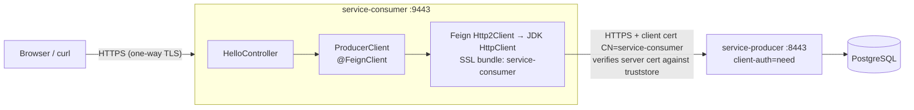
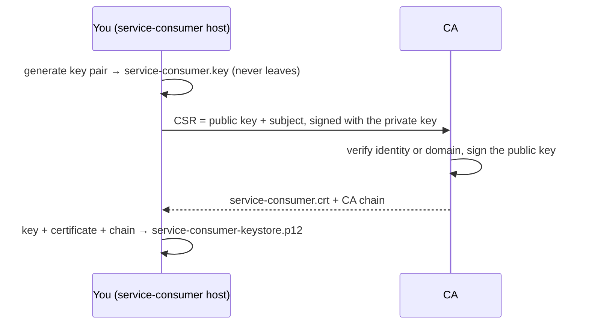
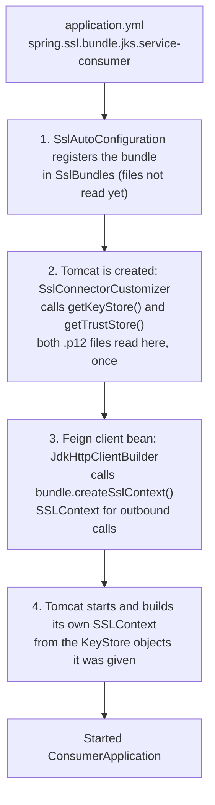
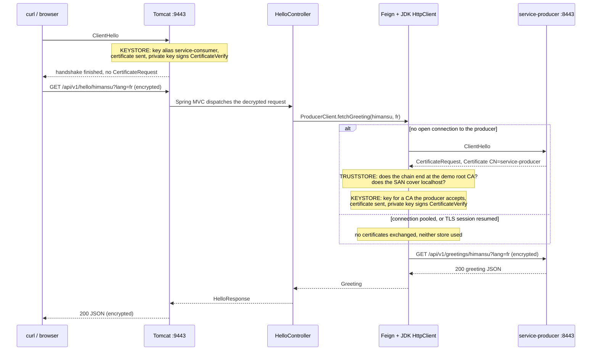

# <span style="color:hsl(200,80%,58%)">service-consumer — mTLS REST Client</span>

## <span style="color:hsl(141,80%,58%)">Table of contents</span>

1. 🧰 [Stack](#stack)
2. 🎯 [What this service does](#what-this-service-does)
3. ✨ [Features used](#features-used)
4. 🔐 [How the consumer does mutual TLS](#how-the-consumer-does-mutual-tls) — concepts: [Security, TLS & encryption](../README.md#security-goals)
5. 🌐 [API](#api)
6. 🚨 [Error mapping](#error-mapping)
7. ⚙️ [Configuration reference](#configuration-reference)
8. 🚀 [Running locally](#running-locally)
9. 🧪 [Testing](#testing)
10. 📁 [Project layout](#project-layout)
11. ⚠️ [Production notes](#production-notes)
12. ❓ [Q&A](#qa)
    - 12.1 [How do I create a keystore and a truststore from a CA-issued `.crt` file?](#qa-keystore-from-crt)
    - 12.2 [Does the CA email me the private key?](#qa-ca-private-key)
    - 12.3 [When exactly are the keystore and the truststore used?](#qa-when-stores-used)
        - [What Spring Boot does at startup](#qa-stores-at-startup)
        - [What happens when an HTTPS request comes in](#qa-stores-per-request)
    - 12.4 [Does a service need a keystore if it only calls another service, or only serves one?](#qa-keystore-by-role)

<a id="stack"></a>
## <span style="color:hsl(278,80%,58%)">1. 🧰 Stack</span>

| Component    | Version / Detail                                                                                  |
|--------------|---------------------------------------------------------------------------------------------------|
| Java         | 25 (`maven.compiler.release` from super-pom; needs JDK 25+)                                       |
| Spring Boot  | 4.1.1 (via `learning-mtls` → `super-pom`)                                                         |
| Spring Cloud | 2025.1.3 (via `learning-bom`): OpenFeign 5.0.3                                                    |
| Web          | Spring MVC on embedded Tomcat, HTTPS (port `9443`)                                                |
| HTTP client  | Feign 13.6.1 [`@FeignClient`][FeignClient] on the JDK [`HttpClient`][HttpClient] (`feign-java11`) |
| JSON         | Jackson 3 (`tools.jackson`, the Spring Boot 4 default)                                            |
| TLS          | Spring Boot SSL bundles, PKCS12, TLS 1.3 / 1.2                                                    |
| Boilerplate  | Lombok + Java records                                                                             |
| Dev loop     | Spring Boot DevTools (auto-restart)                                                               |
| Tests        | JUnit Jupiter 6, [`@WebMvcTest`][WebMvcTest], Mockito                                             |
| Build        | Maven 3.9+                                                                                        |

<a id="what-this-service-does"></a>
## <span style="color:hsl(56,80%,50%)">2. 🎯 What this service does</span>

`service-consumer` is the **client side** of the mTLS pair. It exposes
`GET /api/v1/hello/{name}` and, for each request, calls
[`service-producer`](../service-producer/README.md) over HTTPS, presenting its own client
certificate and validating the producer's server certificate.


```mermaid
flowchart LR
    user["Browser / curl"] -- "HTTPS (one-way TLS)" --> consumer
    subgraph consumer ["service-consumer :9443"]
        hc[HelloController] --> pc["ProducerClient<br/>@FeignClient"] --> rc["Feign Http2Client → JDK HttpClient<br/>SSL bundle: service-consumer"]
    end
    rc -- "HTTPS + client cert CN=service-consumer<br/>verifies server cert against truststore" --> producer["service-producer :8443<br/>client-auth=need"]
    producer --> db[(PostgreSQL)]
```

Both sides validate each other:

| Direction | Who validates | Against |
|---|---|---|
| consumer → producer server cert | consumer's Feign client (JDK [`HttpClient`][HttpClient]) | `ssl/truststore.p12` (demo root CA) + hostname (`localhost` SAN) |
| producer ← consumer client cert | producer's Tomcat + CN filter | producer truststore + `mtls.allowed-client-cns` |

<a id="features-used"></a>
## <span style="color:hsl(193,80%,58%)">3. ✨ Features used</span>

| Feature | Where | Why |
|---|---|---|
| **Spring Boot SSL bundle** (`spring.ssl.bundle.jks.service-consumer`) | `application.yml` | Single definition of identity + trust, reused for the inbound server *and* the outbound client. |
| **OpenFeign client** ([`@FeignClient`][FeignClient]) | `client/ProducerClient` | Declarative interface: one Spring MVC–annotated method per producer endpoint; Feign generates the implementation. |
| **[`@EnableFeignClients(clients = ProducerClient.class)`][EnableFeignClients]** | `config/ProducerClientConfig` | Registers just this client. Kept off the application class so [`@WebMvcTest`][WebMvcTest] slices don't create Feign clients. |
| **Per-client Feign configuration** | `config/ProducerFeignConfiguration` | [`feign.Client`][Client] bean: Feign's [`Http2Client`][Http2Client] over a JDK [`HttpClient`][HttpClient] that Boot's [`JdkHttpClientBuilder`][JdkHttpClientBuilder] builds from [`HttpClientSettings.ofSslBundle(...)`][HttpClientSettings]. It carries the client cert, trust, TLS protocols and connect timeout. [`Request.Options`][Request] sets the per-request timeouts. Not a [`@Configuration`][Configuration], so its beans stay in this client's Feign context. |
| **[`@ConfigurationProperties`][ConfigurationProperties] record** | `config/ProducerClientProperties` | Type-safe `clients.producer.*` (base URL, bundle name, timeout with [`@DefaultValue`][DefaultValue]); `@FeignClient(url = "${clients.producer.base-url}")` reads the URL. |
| **[`@RestControllerAdvice`][RestControllerAdvice] → Problem Details** | `exception/UpstreamExceptionHandler` | Handshake / IO failures → `502`, upstream `404` → `404`, other upstream errors → `502`, all as RFC 9457 JSON. |
| **Lombok** | [`@RequiredArgsConstructor`][RequiredArgsConstructor], [`@Slf4j`][Slf4j] | No hand-written constructors or logger fields. |
| **Records** | `Greeting`, `HelloResponse`, properties | Immutable DTOs. |
| **DevTools** | root `pom.xml` (runtime, optional) | Auto-restart on recompile; not packaged into the jar. |
| **Actuator `info` / `health`** | `management.*`, `info.app.*` | Includes the configured downstream URL. |
| **Custom banner** | `src/main/resources/banner.txt` | Name, versions, port at startup. |

<a id="how-the-consumer-does-mutual-tls"></a>
## <span style="color:hsl(331,80%,58%)">4. 🔐 How the consumer does mutual TLS</span>

### <span style="color:hsl(20,80%,58%)">4.1 Key material</span>

**X.509** is the ITU-T standard that defines the format of a public-key certificate — a
data structure that binds a public key to an identity (the *subject*), signed by an
*issuer* (a CA), valid for a given period, and carrying extensions such as key usage and
subject alternative names. Every `.crt` file and every certificate entry inside the
`.p12` stores below is an X.509 certificate.

The subject is whatever identity the certificate was issued to. In
`service-consumer-keystore.p12` the subject is `CN=service-consumer` — this module's own
identity, presented as the client cert to the producer and also as the server cert on
`:9443`. The CA cert bundled alongside it has itself as subject (it's self-signed).

| File (classpath)                     | Contains | Used for |
|--------------------------------------|----------|----------|
| `ssl/service-consumer-keystore.p12`  | private key + cert `CN=service-consumer` (EKU `serverAuth,clientAuth`) + CA cert | Client cert sent to the producer; also server cert for `:9443` |
| `ssl/truststore.p12`                 | demo root CA only | Validating the producer's server certificate |

Regenerate with this module's own script (shares the root CA in `../certs/out` with the producer's script):

```bash
service-consumer/src/main/resources/ssl/generate-certs.sh
```

It creates the CA on first run, issues a fresh `service-consumer` key + certificate and
rebuilds `truststore.p12`. The script is excluded from the jar.

The producer's script issues its own, separate `CN=service-consumer` test certificate (in
`service-producer/src/test/resources/ssl/`), so regenerating here doesn't touch that one. Both
scripts write `../certs/out`, and the last one to run wins. Keystore vs
truststore, X.509 fields, PKCS#12 and the mTLS handshake are explained in
[root README — PKI, keystores, TLS handshake](../README.md#pki).

### <span style="color:hsl(80,80%,50%)">4.2 Wiring</span>

The client is a plain interface; Feign generates the implementation:

```java
@FeignClient(name = "service-producer", url = "${clients.producer.base-url}", configuration = ProducerFeignConfiguration.class)
public interface ProducerClient {

    @GetMapping("/api/v1/greetings/{name}")
    Greeting fetchGreeting(@PathVariable("name") String name, @RequestParam("lang") String lang);
}
```

The mTLS identity comes from the client's own Feign configuration:

```java
public class ProducerFeignConfiguration {        // deliberately not a @Configuration

    @Bean
    Client producerFeignClient(SslBundles sslBundles, ProducerClientProperties properties) {
        HttpClientSettings settings = HttpClientSettings.ofSslBundle(sslBundles.getBundle(properties.sslBundle()))
                .withConnectTimeout(properties.timeout());

        return new Http2Client(new JdkHttpClientBuilder().build(settings));
    }

    @Bean
    Request.Options producerFeignOptions(ProducerClientProperties properties) {
        return new Request.Options(properties.timeout(), properties.timeout(), true);
    }
}
```

- **Why a custom [`feign.Client`][Client]?** Spring Cloud OpenFeign 5.0 has no SSL-bundle support. Its only
  TLS setting is `spring.cloud.openfeign.httpclient.disable-ssl-validation`. The client certificate
  therefore has to come from the `Client` bean.
- **Why [`JdkHttpClientBuilder`][JdkHttpClientBuilder]?** It's Spring Boot's own bundle-to-[`HttpClient`][HttpClient] mapping. It applies
  the SSL context and the bundle's enabled protocols / ciphers, exactly as Boot does for its own
  HTTP clients. [`Http2Client`][Http2Client] (from `feign-java11`) is Feign's transport for the JDK `HttpClient`.
- **Only a connect timeout on the settings.** `JdkHttpClientBuilder` rejects a read timeout
  (`'settings' must not have a 'readTimeout'`) because the JDK `HttpClient` has no client-wide one.
  Feign's [`Request.Options`][Request] supplies it per request instead.
- **Retries:** Spring Cloud OpenFeign's default [`Retryer`][Retryer] is `NEVER_RETRY`, so a failed handshake
  is not retried.

Hostname verification stays **on**: the producer cert's SAN must match the host in
`clients.producer.base-url`.

> Spring Cloud OpenFeign is feature-complete (maintenance mode). The Spring-native alternative is
> an [`@HttpExchange`][HttpExchange] interface backed by [`RestClient`][RestClient]. Boot 4 configures those per group, SSL
> bundle included, with `spring.http.serviceclient.<group>.ssl.bundle`; no custom client bean needed.

<a id="api"></a>
## <span style="color:hsl(300,70%,60%)">5. 🌐 API</span>

### `GET /api/v1/hello/{name}?lang={code}`

| Param | In | Default | Description |
|---|---|---|---|
| `name` | path | — | Name to greet |
| `lang` | query | `en` | Passed through to the producer |

**200**

```json
{
  "consumer": "service-consumer",
  "upstream": {
    "message": "Bonjour, himansu !",
    "language": "fr",
    "servedBy": "service-producer",
    "callerCn": "service-consumer",
    "timestamp": "2026-09-23T18:41:56.596346460Z"
  }
}
```

`upstream.callerCn` is the CN the **producer** read from our client certificate — proof that mTLS happened.

<a id="error-mapping"></a>
## <span style="color:hsl(0,70%,60%)">6. 🚨 Error mapping</span>

| Upstream outcome | Exception | Consumer response |
|---|---|---|
| TLS handshake fails (untrusted producer cert, producer rejects our cert), connection refused, timeout | [`feign.RetryableException`][RetryableException] (Feign wraps the [`IOException`][IOException]) | `502` — `service-producer unreachable or TLS handshake failed` |
| Producer `404` (unknown language) | [`FeignException.NotFound`][FeignException] | `404` — `Greeting not found upstream` |
| Producer `403` or any other error | `FeignException` | `502` — `service-producer responded <status>`, e.g. `service-producer responded 403` |

Every error body is `application/problem+json`, for example:

```json
{"detail":"service-producer unreachable or TLS handshake failed","instance":"/api/v1/hello/x","status":502,"title":"Bad Gateway"}
```

<a id="configuration-reference"></a>
## <span style="color:hsl(30,80%,55%)">7. ⚙️ Configuration reference</span>

| Env var | Default | Purpose |
|---|---|---|
| `PRODUCER_URL` | `https://localhost:8443` | Producer base URL |
| `SSL_KEYSTORE_LOCATION` | `classpath:ssl/service-consumer-keystore.p12` | Override to `file:/path` for mounted secrets |
| `SSL_TRUSTSTORE_LOCATION` | `classpath:ssl/truststore.p12` | Same |
| `KEYSTORE_PASSWORD` / `TRUSTSTORE_PASSWORD` | `changeit` | Store passwords |

| Property | Value |
|---|---|
| `server.port` | `9443` |
| `clients.producer.ssl-bundle` | `service-consumer` |
| `clients.producer.timeout` | `5s`: connect timeout of the JDK [`HttpClient`][HttpClient] and Feign's per-request read timeout |

<a id="running-locally"></a>
## <span style="color:hsl(200,80%,55%)">8. 🚀 Running locally</span>

Start [`service-producer`](../service-producer/README.md#running-locally) first, then:

```bash
cd service-consumer
mvn spring-boot:run                               # DevTools restarts on recompile

# from certs/out (fresh clone? create the PEMs first: root README → Quick start, step 3)
curl --cacert ca.crt "https://localhost:9443/api/v1/hello/himansu?lang=fr"
```

Verify the consumer really validates the producer. Stop the consumer, then restart it with a
truststore that does **not** contain the demo CA:

```bash
# a throwaway CA that the producer's certificate does not chain to
openssl req -x509 -newkey rsa:2048 -nodes -days 1 -subj "/CN=Rogue CA" \
  -keyout /tmp/rogue.key -out /tmp/rogue.crt
keytool -importcert -noprompt -alias rogue -file /tmp/rogue.crt \
  -keystore /tmp/other-truststore.p12 -storetype PKCS12 -storepass changeit

SSL_TRUSTSTORE_LOCATION=file:/tmp/other-truststore.p12 mvn spring-boot:run
curl -k https://localhost:9443/api/v1/hello/x
# 502 {"detail":"service-producer unreachable or TLS handshake failed", …}
# log: (certificate_unknown) PKIX path building failed … unable to find valid certification path to requested target executing GET https://…
```

Inbound HTTPS on `:9443` keeps working because the truststore is only used for outbound calls.
`:9443` doesn't request client certificates.

<a id="testing"></a>
## <span style="color:hsl(120,60%,45%)">9. 🧪 Testing</span>

```bash
mvn -pl service-consumer verify
```

`HelloControllerTest` ([`@WebMvcTest`][WebMvcTest], `ProducerClient` mocked with [`@MockitoBean`][MockitoBean]):

| Test | Expected |
|---|---|
| `wrapsUpstreamGreeting` | `200`, upstream greeting wrapped with `consumer` field |
| `handshakeFailureBecomesBadGateway` | [`RetryableException`][RetryableException] (cause [`SSLHandshakeException`][SSLHandshakeException]) → `502` problem detail |
| `upstreamNotFoundPassesThrough` | [`FeignException.NotFound`][FeignException] → `404` problem detail |
| `upstreamForbiddenBecomesBadGateway` | `FeignException.Forbidden` → `502`, `service-producer responded 403` |

No automated test drives this module's Feign client + SSL bundle against a live producer. The mTLS
handshake is tested from the producer side: `service-producer`'s `MtlsIntegrationTest` uses the
producer module's own `CN=service-consumer` test keystore (`service-producer/src/test/resources/ssl/`).
That is a separately issued key pair, not this module's keystore. To check this module's wiring end to
end, use the `curl` flow in [Running locally](#running-locally).

<a id="project-layout"></a>
## <span style="color:hsl(260,60%,65%)">10. 📁 Project layout</span>

```
service-consumer
├── pom.xml                                     parent: learning-mtls → super-pom
└── src
    ├── main
    │   ├── java/com/org/mtls/consumer
    │   │   ├── ConsumerApplication.java
    │   │   ├── client
    │   │   │   └── ProducerClient.java              @FeignClient → GET /api/v1/greetings/{name}
    │   │   ├── config
    │   │   │   ├── ProducerClientConfig.java        @EnableFeignClients
    │   │   │   ├── ProducerClientProperties.java    clients.producer.*
    │   │   │   └── ProducerFeignConfiguration.java  feign.Client on the SSL bundle + timeouts
    │   │   ├── controller
    │   │   │   └── HelloController.java           GET /api/v1/hello/{name}
    │   │   └── exception
    │   │       └── UpstreamExceptionHandler.java  upstream failures → problem details
    │   └── resources
    │       ├── application.yml
    │       ├── banner.txt
    │       └── ssl/generate-certs.sh, service-consumer-keystore.p12, truststore.p12
    └── test/java/com/org/mtls/consumer/controller/HelloControllerTest.java
```

<a id="production-notes"></a>
## <span style="color:hsl(0,80%,60%)">11. ⚠️ Production notes</span>

- The committed `.p12` files are **demo-only**; mount real stores and set `SSL_*_LOCATION=file:/…`.
- Replace `changeit`; inject store passwords from a secret manager.
- Inbound `:9443` is one-way TLS. Add `server.ssl.client-auth: need` if callers of the consumer must also authenticate.
- For real traffic, add circuit breaking with `spring.cloud.openfeign.circuitbreaker.enabled=true` plus a
  Spring Cloud CircuitBreaker implementation (e.g. Resilience4j). Add an explicit [`Retryer`][Retryer] only for idempotent calls.

<a id="qa"></a>
## <span style="color:hsl(190,80%,50%)">12. ❓ Q&A</span>

<a id="qa-keystore-from-crt"></a>
### <span style="color:hsl(20,80%,58%)">12.1 How do I create a keystore and a truststore from a CA-issued `.crt` file?</span>

**Q:** How can you create a keystore and a truststore from an X.509 `.crt` file issued by a CA?

**A:** The truststore needs only the CA certificate. The keystore also needs the **private key**, and a
`.crt` does not contain one: the CA only signed the public key from your CSR. The private key is
wherever the CSR was generated, either a `.key` file (openssl) or the keystore you ran
`keytool -certreq` against.

| File | `service-consumer-keystore.p12` | `truststore.p12` |
|---|---|---|
| `service-consumer.key`: private key from the CSR step | ✅ | ❌ |
| `service-consumer.crt`: certificate issued by the CA | ✅ | ❌ |
| `ca.crt`: CA certificate, plus any intermediates | ✅ as the chain | ✅ |

**Keystore, when the CSR was made with openssl** (the key is a `.key` file). This is what
`generate-certs.sh` does:

```bash
# check that key and certificate belong together: both hashes must be identical
openssl x509 -noout -pubkey -in service-consumer.crt | openssl sha256
openssl pkey -pubout -in service-consumer.key | openssl sha256

# with intermediates, bundle the chain first: cat intermediate.crt root.crt > ca.crt
openssl pkcs12 -export -name service-consumer \
  -inkey service-consumer.key -in service-consumer.crt -certfile ca.crt \
  -out service-consumer-keystore.p12 -passout pass:changeit
```

`-name` becomes the entry's alias. It must match `spring.ssl.bundle.jks.service-consumer.key.alias`
(`service-consumer`).

**Keystore, when the CSR was made with keytool** (the key already sits in a keystore). Import the CA
chain, then the signed certificate under the **same alias as the key**. That replaces the self-signed
placeholder, and the entry stays a `PrivateKeyEntry`:

```bash
keytool -importcert -noprompt -alias ca -file ca.crt \
  -keystore service-consumer-keystore.p12 -storepass changeit
keytool -importcert -alias service-consumer -file service-consumer.crt \
  -keystore service-consumer-keystore.p12 -storepass changeit
```

**Truststore**, the CA certificate only:

```bash
keytool -importcert -noprompt -alias mtls-demo-ca -file ca.crt \
  -keystore truststore.p12 -storetype PKCS12 -storepass changeit
```

The consumer's truststore must hold the CA that signed the **producer's** server certificate,
not `service-consumer.crt`. The JDK [`HttpClient`][HttpClient] also checks the producer certificate's SAN against the host in
`clients.producer.base-url`. For more CAs, repeat `-importcert` with another alias.

Ask the CA for extended key usage **`clientAuth`**. This module's certificate has
`serverAuth,clientAuth` because it is also the `:9443` server certificate. If a certificate's EKU
lacks `clientAuth`, the producer's handshake rejects it (`Extended key usage does not permit use for
TLS client authentication`). Public web CAs are phasing `clientAuth` out of
their TLS certificates, so mTLS client certificates normally come from a private CA, like the
demo CA here.

**Check the result**, then point the bundle at the new files with `SSL_KEYSTORE_LOCATION=file:/…` and
`SSL_TRUSTSTORE_LOCATION=file:/…` ([Configuration reference](#configuration-reference)):

```bash
# expect: Entry type: PrivateKeyEntry, Certificate chain length: 2 or more
keytool -list -v -keystore service-consumer-keystore.p12 -storepass changeit
# expect: one trustedCertEntry per CA
keytool -list -keystore truststore.p12 -storepass changeit
```

**Traps**

- **Lost private key:** it cannot be recovered. Generate a new key and CSR, and ask the CA to reissue
  the certificate (rekey).
- **DER instead of PEM** (binary, no `-----BEGIN`): convert it with
  `openssl x509 -inform der -in cert.cer -out cert.crt`.
- **Chain missing from the keystore:** clients that don't have the intermediate fail with
  `PKIX path building failed`.
- **mTLS:** each side has its own keystore (its own key and certificate), and each side's truststore
  holds the CA that signed the *other* side's certificate.

Keystore vs truststore and the store formats are covered in
[root README — keystores, truststores and file formats](../README.md#stores-and-formats).

<a id="qa-ca-private-key"></a>
### <span style="color:hsl(80,80%,50%)">12.2 Does the CA email me the private key?</span>

**Q:** Does the CA mail you the private key?

**A:** No. In the normal flow the CA never has the private key, so it has nothing to send. You generate
the key pair and send a **CSR** (certificate signing request): your public key and subject, signed
with your private key to prove you hold it. The CA checks who you are, signs the public key and sends
back only the certificate.


```mermaid
sequenceDiagram
    participant You as You (service-consumer host)
    participant CA
    You->>You: generate key pair → service-consumer.key (never leaves)
    You->>CA: CSR = public key + subject, signed with the private key
    CA->>CA: verify identity or domain, sign the public key
    CA-->>You: service-consumer.crt + CA chain
    You->>You: key + certificate + chain → service-consumer-keystore.p12
```

```bash
# -addext requests the SAN: this certificate is also the :9443 server certificate
openssl req -new -newkey rsa:2048 -nodes -sha256 \
  -keyout service-consumer.key -out service-consumer.csr \
  -subj "/CN=service-consumer/O=com.org" \
  -addext "subjectAltName=DNS:service-consumer,DNS:localhost,IP:127.0.0.1"
# send service-consumer.csr to the CA and keep service-consumer.key private
```

`generate-certs.sh` plays both roles on one machine. It creates the key and CSR, then signs the CSR
with the demo CA's `ca.key`, which stays in the git-ignored `certs/out` at the repo root. No private
key ever travels.

**Exception: the CA generates the key for you.** Some CAs, enterprise PKI portals (for example
Microsoft AD CS web enrollment or Venafi) and cloud consoles can create the key pair on their side.
You then download a password-protected `.pfx`/`.p12` holding key, certificate and chain. That file
already is a keystore: point `SSL_KEYSTORE_LOCATION` at it and set `key.alias` to its entry (see
`keytool -list`), or convert it:

```bash
keytool -importkeystore -srckeystore download.pfx -srcstoretype PKCS12 \
  -destkeystore service-consumer-keystore.p12 -deststoretype PKCS12
```

> ⚠️ Whoever generated the key has seen it. Treat a private key sent **by email** as compromised:
> mail servers and inboxes keep copies. Prefer the CSR flow. If server-side generation is
> unavoidable, download over HTTPS and protect the file with a strong password.

**So where is my key?** Wherever the CSR was made:

- **openssl:** the `.key` file next to the `.csr`.
- **keytool:** inside the `.jks`/`.p12` used with `keytool -certreq`.
- **IIS / Windows:** in the Windows certificate store. Complete the certificate request, then export
  a `.pfx`.
- **A teammate or ops made the CSR:** ask them.

Not found anywhere? Then it is lost. Create a new key and CSR and ask the CA to reissue the
certificate (rekey); most CAs do that free of charge while the certificate is still valid.

<a id="qa-when-stores-used"></a>
### <span style="color:hsl(300,70%,60%)">12.3 When exactly are the keystore and the truststore used?</span>

**Q:** When exactly are the truststore and the keystore used in the service-consumer microservice?
What does Spring Boot do with them at startup, and what happens when an HTTPS request comes in?

**A:** Spring Boot **reads** both files once, while the application starts, and turns them into two
[`SSLContext`][SSLContext]s:

- one inside Tomcat, for inbound HTTPS on `:9443`;
- one inside the Feign client's JDK [`HttpClient`][HttpClient], for outbound calls to the producer.

From then on the stores are only **consulted during a TLS handshake**: the keystore through the key
managers inside those contexts, the truststore through their trust managers. A request over an
already-open connection touches neither. Neither store encrypts any data either: the private key only
signs the handshake, and the traffic is encrypted with session keys that the handshake agrees on.

| When | Keystore `service-consumer-keystore.p12` | Truststore `truststore.p12` |
|---|---|---|
| Startup | read once, then built into both `SSLContext`s | read once, then built into both `SSLContext`s |
| A caller opens a connection to `:9443` | ✅ Tomcat sends the `CN=service-consumer` certificate and signs the handshake | ❌ loaded in Tomcat but never asked: `:9443` requests no client certificate |
| First call to the producer (new connection) | ✅ answers the producer's `CertificateRequest` | ✅ checks the producer's certificate chain and hostname |
| Next calls over the same connection | ❌ | ❌ |
| New connection that resumes the TLS session | ❌ | ❌ |

<a id="qa-stores-at-startup"></a>
#### What Spring Boot does at startup


```mermaid
flowchart TD
    Y["application.yml<br/>spring.ssl.bundle.jks.service-consumer"] --> R["1. SslAutoConfiguration registers the bundle<br/>in SslBundles (files not read yet)"]
    R --> T["2. Tomcat is created: SslConnectorCustomizer<br/>calls getKeyStore() and getTrustStore()<br/>both .p12 files read here, once"]
    T --> F["3. Feign client bean: JdkHttpClientBuilder<br/>calls bundle.createSslContext()<br/>SSLContext for outbound calls"]
    F --> S["4. Tomcat starts and builds its own SSLContext<br/>from the KeyStore objects it was given"]
    S --> D["Started ConsumerApplication"]
```

1. **Registration.** [`SslAutoConfiguration`][SslAutoConfiguration] binds `spring.ssl.bundle.jks.service-consumer`: keystore,
   truststore, `key.alias` and `options.enabled-protocols`. [`SslPropertiesBundleRegistrar`][SslPropertiesBundleRegistrar] then registers
   it as a [`PropertiesSslBundle`][PropertiesSslBundle] in [`DefaultSslBundleRegistry`][DefaultSslBundleRegistry], the [`SslBundles`][SslBundles] bean. Nothing is read
   yet. [`JksSslStoreBundle`][JksSslStoreBundle] keeps each store behind a [`SingletonSupplier`][SingletonSupplier], which opens the file the
   first time the store is asked for.
2. **Tomcat is created.** This happens in `onRefresh`, before the application's own beans. Because of
   `server.ssl.bundle: service-consumer`, [`TomcatWebServerFactory`][TomcatWebServerFactory] applies the bundle through
   [`SslConnectorCustomizer`][SslConnectorCustomizer], which calls `getKeyStore()` and `getTrustStore()`. **This is the moment
   both `.p12` files are read**, once. Tomcat receives:
   - the two loaded [`KeyStore`][KeyStore] objects;
   - the key alias and password;
   - the enabled protocols;
   - `certificateVerification = none`, because `server.ssl.client-auth` isn't set.

   A wrong path or password fails right here, before anything else starts:
   `Could not load store: … Could not load store from 'file:/…'`.
3. **The Feign client is built** during bean creation. `ProducerFeignConfiguration` fetches the
   bundle from `SslBundles` and passes it to [`JdkHttpClientBuilder`][JdkHttpClientBuilder], which calls
   [`SslBundle.createSslContext()`][SslBundle]. Behind that call, [`DefaultSslManagerBundle`][DefaultSslManagerBundle]:
   - checks that `key.alias` exists in the keystore;
   - builds a [`KeyManagerFactory`][KeyManagerFactory] from the keystore, wrapped in Spring's [`AliasKeyManagerFactory`][AliasKeyManagerFactory];
   - builds a PKIX [`TrustManagerFactory`][TrustManagerFactory] from the truststore;
   - calls [`SSLContext.init(keyManagers, trustManagers, null)`][SSLContext].

   The context goes into [`HttpClient.newBuilder().sslContext(...)`][HttpClient], together with [`SSLParameters`][SSLParameters]
   carrying the enabled protocols. JSSE logs `found key for : service-consumer` and
   `adding as trusted certificates` on the `main` thread.
4. **Tomcat starts** at the end of the refresh. It builds its own `SSLContext` from the `KeyStore`
   objects it was given, keeping only the key entry named by `key.alias`. JSSE logs the same two lines
   again, then Boot logs `Tomcat started on port 9443 (https)`. Tomcat creates trust managers from the
   truststore as well, but with `certificateVerification = none` they are never consulted.

After startup the files are not read again, so replacing them on disk has no effect until a restart.
With `reload-on-update: true` and `file:` locations, Boot's file watcher re-registers the bundle and
pushes it to Tomcat (`SslConnectorCustomizer.update`). The Feign `HttpClient`, however, keeps the
`SSLContext` it was built with.

<a id="qa-stores-per-request"></a>
#### What happens when an HTTPS request comes in


```mermaid
sequenceDiagram
    participant U as curl / browser
    participant T as Tomcat :9443
    participant H as HelloController
    participant F as Feign + JDK HttpClient
    participant P as service-producer :8443
    U->>T: ClientHello
    Note over T: KEYSTORE: key alias service-consumer,<br/>certificate sent, private key signs CertificateVerify
    T-->>U: handshake finished, no CertificateRequest
    U->>T: GET /api/v1/hello/himansu?lang=fr (encrypted)
    T->>H: Spring MVC dispatches the decrypted request
    H->>F: ProducerClient.fetchGreeting(himansu, fr)
    alt no open connection to the producer
        F->>P: ClientHello
        P-->>F: CertificateRequest, Certificate CN=service-producer
        Note over F: TRUSTSTORE: does the chain end at the demo root CA?<br/>does the SAN cover localhost?
        Note over F: KEYSTORE: key for a CA the producer accepts,<br/>certificate sent, private key signs CertificateVerify
    else connection pooled, or TLS session resumed
        Note over F: no certificates exchanged, neither store used
    end
    F->>P: GET /api/v1/greetings/himansu?lang=fr (encrypted)
    P-->>F: 200 greeting JSON
    F-->>H: Greeting
    H-->>T: HelloResponse
    T-->>U: 200 JSON (encrypted)
```

**Inbound on `:9443`: keystore only.** Tomcat's NIO connector accepts the connection and runs the
server side of the handshake on an [`SSLEngine`][SSLEngine] from its [`SSLContext`][SSLContext]. Its key manager returns the
configured alias (`matching alias: service-consumer`), and Tomcat sends that certificate chain and
signs `CertificateVerify` with the private key. It sends no `CertificateRequest`, because
`certificateVerification` is `none`, so the truststore stays idle. Only after the handshake does Tomcat
decrypt the request and hand it to [`DispatcherServlet`][DispatcherServlet]. That's why `:9443` keeps working in the
rogue-truststore test under [Running locally](#running-locally).

**Outbound from Feign to the producer: both stores.** `HelloController` calls `ProducerClient`, and
Feign's [`Http2Client`][Http2Client] passes the request to the JDK [`HttpClient`][HttpClient]. The client first looks for an open
connection to `localhost:8443`. Only when there is none does it open one and run the client side of
the handshake on the Feign `SSLContext`:

1. **The producer's `Certificate` arrives, and the truststore is used.** The trust manager validates
   the chain up to the demo root CA (`Found trusted certificate`). Because the `HttpClient` turns on
   hostname verification, it also checks that the certificate's SAN covers `localhost`. A failure here
   shows up as `PKIX path building failed`, and the consumer answers `502`.
2. **The producer's `CertificateRequest` is answered, and the keystore is used.** The producer runs
   with `client-auth: need`, and its request names the CAs it accepts
   (`CN=mTLS Demo Root CA, O=com.org`). The key manager picks a key whose certificate chains to one of
   them. Spring's [`AliasKeyManagerFactory`][AliasKeyManagerFactory] pins `key.alias` only in the server role; in the client role
   the JDK chooses by key type and issuer. With a single key entry, that is `service-consumer`
   (`matching alias: service-consumer`). The certificate chain is sent, and the private key signs
   `CertificateVerify`.
3. **With the handshake finished**, the HTTP request leaves the consumer, encrypted with the session
   keys.

**Every call after that uses neither store.**

- The JDK `HttpClient` keeps the connection in its pool, and Feign reuses it. A call made soon after
  the previous one needs no handshake at all; in the test run, the second call opened no connection.
  The pool drops a connection after 30 s without use (`jdk.httpclient.keepalive.timeout`, JDK 25
  default); a call 50 s after the previous one needed a new connection.
- When a new connection is needed, the client resumes the TLS 1.3 session with the ticket it got from
  the first handshake (`Try resuming session`, then `Found resumable session. Preparing PSK message.`).
  No certificate travels in either direction, and neither store is consulted. The producer still
  reports `callerCn: service-consumer`, because the resumed session carries the certificate from the
  original handshake.
- Both stores come back into play only for a **full** handshake: after either service restarts, or
  once the session ticket expires.

The log messages quoted here come from a traced run with
`-Djavax.net.debug=ssl:handshake:keymanager:trustmanager` on the consumer. The class names come from
the Spring Boot 4.1.1 and Tomcat 11.0.24 sources. How to produce such a trace:
[root README — TLS handshake trace](../README.md#tls-handshake-trace). Every handshake message in
detail: [root README — the mTLS handshake step by step](../README.md#the-mtls-handshake).

<a id="qa-keystore-by-role"></a>
### <span style="color:hsl(165,80%,45%)">12.4 Does a service need a keystore if it only calls another service, or only serves one?</span>

**Q:** Does a service need a keystore if it only consumes an external service but doesn't expose
any REST API, or the other way round?

**A:** It depends on which side has to prove its identity, not on which way the calls go. A
**keystore** holds the service's *own* private key and certificate. It's needed whenever *this*
service must prove who it is in a TLS handshake. A **truststore** holds the CA certificates used to
check *the other side*.

| Service | TLS mode | Keystore | Truststore |
|---|---|---|---|
| Only calls other services | one-way TLS (ordinary HTTPS) | ❌ not needed | only if the server's CA isn't already trusted by the JDK (`cacerts`), e.g. a private CA like the demo CA here |
| Only calls other services | mTLS: the server asks for a client certificate | ✅ its client certificate and key | same rule as above |
| Only serves an API | HTTPS | ✅ its server certificate and key | ❌ not needed |
| Only serves an API | mTLS (`client-auth: need`) | ✅ | ✅ the CAs whose client certificates it accepts |
| Only serves an API, TLS ends in front of it (ingress, load balancer, service mesh) | plain HTTP inside | ❌ | ❌ |

- **A pure client using ordinary HTTPS needs no keystore.** Calling a public API only requires
  trusting the server's CA, and the JDK's default truststore already holds the public CAs. There is
  nothing to configure.
- **A pure client needs a keystore as soon as the server asks for a client certificate.** Without one,
  it answers the `CertificateRequest` with an empty certificate, and a server running
  `client-auth: need` aborts the handshake with `certificate_required`.
- **A pure server always needs a keystore for HTTPS**, because it must present a certificate and sign
  the handshake with its private key. It needs a truststore only if it verifies client certificates.

**What that means for this module.** The consumer uses its keystore for both roles: as the client
certificate towards the producer and as the server certificate on `:9443`.

- If the consumer exposed no API at all, it would still need `service-consumer-keystore.p12`, because
  the producer runs `client-auth: need`.
- If the producer stopped asking for client certificates, the consumer would need no keystore for its
  calls. It would still need a truststore with the demo CA, because the producer's certificate comes
  from a private CA.

In Spring Boot, an SSL bundle may hold just one of the two stores:

- **Truststore only:** gives an HTTP client trust in a private CA without presenting a client
  certificate.
- **Keystore only:** trust falls back to the JDK's default truststore. [`DefaultSslManagerBundle`][DefaultSslManagerBundle]
  initialises the [`TrustManagerFactory`][TrustManagerFactory] with `null`, and `null` means the JDK default.
- **Server side:** `server.ssl.bundle` needs the keystore. Add a truststore and
  `server.ssl.client-auth: need` only for mTLS.

<!-- Library classes mentioned above, linked to their source at the versions this project builds with. -->

[AliasKeyManagerFactory]: https://github.com/spring-projects/spring-boot/blob/v4.1.1/core/spring-boot/src/main/java/org/springframework/boot/ssl/AliasKeyManagerFactory.java
[Client]: https://github.com/OpenFeign/feign/blob/13.6.1/core/src/main/java/feign/Client.java
[Configuration]: https://github.com/spring-projects/spring-framework/blob/v7.0.9/spring-context/src/main/java/org/springframework/context/annotation/Configuration.java
[ConfigurationProperties]: https://github.com/spring-projects/spring-boot/blob/v4.1.1/core/spring-boot/src/main/java/org/springframework/boot/context/properties/ConfigurationProperties.java
[DefaultSslBundleRegistry]: https://github.com/spring-projects/spring-boot/blob/v4.1.1/core/spring-boot/src/main/java/org/springframework/boot/ssl/DefaultSslBundleRegistry.java
[DefaultSslManagerBundle]: https://github.com/spring-projects/spring-boot/blob/v4.1.1/core/spring-boot/src/main/java/org/springframework/boot/ssl/DefaultSslManagerBundle.java
[DefaultValue]: https://github.com/spring-projects/spring-boot/blob/v4.1.1/core/spring-boot/src/main/java/org/springframework/boot/context/properties/bind/DefaultValue.java
[DispatcherServlet]: https://github.com/spring-projects/spring-framework/blob/v7.0.9/spring-webmvc/src/main/java/org/springframework/web/servlet/DispatcherServlet.java
[EnableFeignClients]: https://github.com/spring-cloud/spring-cloud-openfeign/blob/v5.0.3/spring-cloud-openfeign-core/src/main/java/org/springframework/cloud/openfeign/EnableFeignClients.java
[FeignClient]: https://github.com/spring-cloud/spring-cloud-openfeign/blob/v5.0.3/spring-cloud-openfeign-core/src/main/java/org/springframework/cloud/openfeign/FeignClient.java
[FeignException]: https://github.com/OpenFeign/feign/blob/13.6.1/core/src/main/java/feign/FeignException.java
[Http2Client]: https://github.com/OpenFeign/feign/blob/13.6.1/java11/src/main/java/feign/http2client/Http2Client.java
[HttpClient]: https://github.com/openjdk/jdk/blob/jdk-25-ga/src/java.net.http/share/classes/java/net/http/HttpClient.java
[HttpClientSettings]: https://github.com/spring-projects/spring-boot/blob/v4.1.1/module/spring-boot-http-client/src/main/java/org/springframework/boot/http/client/HttpClientSettings.java
[HttpExchange]: https://github.com/spring-projects/spring-framework/blob/v7.0.9/spring-web/src/main/java/org/springframework/web/service/annotation/HttpExchange.java
[IOException]: https://github.com/openjdk/jdk/blob/jdk-25-ga/src/java.base/share/classes/java/io/IOException.java
[JdkHttpClientBuilder]: https://github.com/spring-projects/spring-boot/blob/v4.1.1/module/spring-boot-http-client/src/main/java/org/springframework/boot/http/client/JdkHttpClientBuilder.java
[JksSslStoreBundle]: https://github.com/spring-projects/spring-boot/blob/v4.1.1/core/spring-boot/src/main/java/org/springframework/boot/ssl/jks/JksSslStoreBundle.java
[KeyManagerFactory]: https://github.com/openjdk/jdk/blob/jdk-25-ga/src/java.base/share/classes/javax/net/ssl/KeyManagerFactory.java
[KeyStore]: https://github.com/openjdk/jdk/blob/jdk-25-ga/src/java.base/share/classes/java/security/KeyStore.java
[MockitoBean]: https://github.com/spring-projects/spring-framework/blob/v7.0.9/spring-test/src/main/java/org/springframework/test/context/bean/override/mockito/MockitoBean.java
[PropertiesSslBundle]: https://github.com/spring-projects/spring-boot/blob/v4.1.1/core/spring-boot-autoconfigure/src/main/java/org/springframework/boot/autoconfigure/ssl/PropertiesSslBundle.java
[Request]: https://github.com/OpenFeign/feign/blob/13.6.1/core/src/main/java/feign/Request.java
[RequiredArgsConstructor]: https://github.com/projectlombok/lombok/blob/v1.18.46/src/core/lombok/RequiredArgsConstructor.java
[RestClient]: https://github.com/spring-projects/spring-framework/blob/v7.0.9/spring-web/src/main/java/org/springframework/web/client/RestClient.java
[RestControllerAdvice]: https://github.com/spring-projects/spring-framework/blob/v7.0.9/spring-web/src/main/java/org/springframework/web/bind/annotation/RestControllerAdvice.java
[RetryableException]: https://github.com/OpenFeign/feign/blob/13.6.1/core/src/main/java/feign/RetryableException.java
[Retryer]: https://github.com/OpenFeign/feign/blob/13.6.1/core/src/main/java/feign/Retryer.java
[SingletonSupplier]: https://github.com/spring-projects/spring-framework/blob/v7.0.9/spring-core/src/main/java/org/springframework/util/function/SingletonSupplier.java
[Slf4j]: https://github.com/projectlombok/lombok/blob/v1.18.46/src/core/lombok/extern/slf4j/Slf4j.java
[SslAutoConfiguration]: https://github.com/spring-projects/spring-boot/blob/v4.1.1/core/spring-boot-autoconfigure/src/main/java/org/springframework/boot/autoconfigure/ssl/SslAutoConfiguration.java
[SslBundle]: https://github.com/spring-projects/spring-boot/blob/v4.1.1/core/spring-boot/src/main/java/org/springframework/boot/ssl/SslBundle.java
[SslBundles]: https://github.com/spring-projects/spring-boot/blob/v4.1.1/core/spring-boot/src/main/java/org/springframework/boot/ssl/SslBundles.java
[SslConnectorCustomizer]: https://github.com/spring-projects/spring-boot/blob/v4.1.1/module/spring-boot-tomcat/src/main/java/org/springframework/boot/tomcat/SslConnectorCustomizer.java
[SSLContext]: https://github.com/openjdk/jdk/blob/jdk-25-ga/src/java.base/share/classes/javax/net/ssl/SSLContext.java
[SSLEngine]: https://github.com/openjdk/jdk/blob/jdk-25-ga/src/java.base/share/classes/javax/net/ssl/SSLEngine.java
[SSLHandshakeException]: https://github.com/openjdk/jdk/blob/jdk-25-ga/src/java.base/share/classes/javax/net/ssl/SSLHandshakeException.java
[SSLParameters]: https://github.com/openjdk/jdk/blob/jdk-25-ga/src/java.base/share/classes/javax/net/ssl/SSLParameters.java
[SslPropertiesBundleRegistrar]: https://github.com/spring-projects/spring-boot/blob/v4.1.1/core/spring-boot-autoconfigure/src/main/java/org/springframework/boot/autoconfigure/ssl/SslPropertiesBundleRegistrar.java
[TomcatWebServerFactory]: https://github.com/spring-projects/spring-boot/blob/v4.1.1/module/spring-boot-tomcat/src/main/java/org/springframework/boot/tomcat/TomcatWebServerFactory.java
[TrustManagerFactory]: https://github.com/openjdk/jdk/blob/jdk-25-ga/src/java.base/share/classes/javax/net/ssl/TrustManagerFactory.java
[WebMvcTest]: https://github.com/spring-projects/spring-boot/blob/v4.1.1/module/spring-boot-webmvc-test/src/main/java/org/springframework/boot/webmvc/test/autoconfigure/WebMvcTest.java
