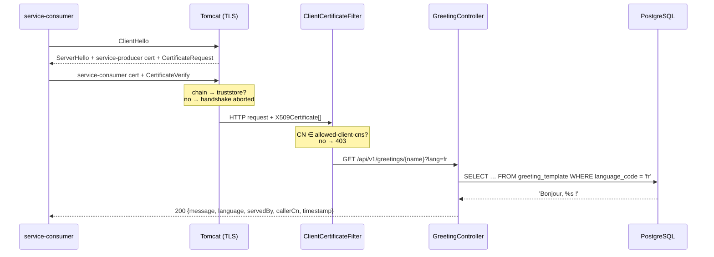

# <span style="color:hsl(3,80%,58%)">service-producer — mTLS REST Provider</span>

## <span style="color:hsl(141,80%,58%)">Table of contents</span>

1. 🧰 [Stack](#stack)
2. 🎯 [What this service does](#what-this-service-does)
3. ✨ [Features used](#features-used)
4. 🔐 [How mutual TLS is enforced](#how-mutual-tls-is-enforced)
5. 🗄️ [Database — PostgreSQL + Flyway](#database)
6. 🔑 [Encrypted DB password — Jasypt `ENC(...)`](#encrypted-db-password)
7. 🌐 [API](#api)
8. ⚙️ [Configuration reference](#configuration-reference)
9. 🚀 [Running locally](#running-locally)
10. 🧪 [Testing](#testing)
11. 📁 [Project layout](#project-layout)
12. ⚠️ [Production notes](#production-notes)

<a id="stack"></a>
## <span style="color:hsl(278,80%,58%)">1. 🧰 Stack</span>

| Component          | Version / Detail                                        |
|--------------------|---------------------------------------------------------|
| Java               | 25 (enforced by super-pom: 21+)                         |
| Spring Boot        | 4.1.0 (via `learning-mtls` → `super-pom`)               |
| Web                | Spring MVC on embedded Tomcat, HTTPS only (port `8443`) |
| TLS                | Spring Boot SSL bundles, PKCS12, TLS 1.3 / 1.2          |
| Persistence        | Spring Data JDBC + PostgreSQL 19 (beta3)                |
| Migrations         | Flyway (`flyway-database-postgresql`)                   |
| Secret encryption  | Jasypt Spring Boot 4.0.4 (`PBEWITHHMACSHA512ANDAES_256`)|
| Boilerplate        | Lombok + Java records                                   |
| Dev loop           | Spring Boot DevTools (auto-restart)                     |
| Tests              | JUnit 5, Testcontainers (PostgreSQL), RestClient        |
| Build              | Maven 3.9+                                              |

<a id="what-this-service-does"></a>
## <span style="color:hsl(56,80%,50%)">2. 🎯 What this service does</span>

`service-producer` is the **server side** of the mTLS pair. It exposes one REST endpoint that
returns a localised greeting read from PostgreSQL. It accepts a connection **only** when the
caller presents a client certificate that

1. chains to the demo root CA in its truststore (checked by Tomcat during the TLS handshake), and
2. carries an allow-listed Common Name — `service-consumer` (checked by a servlet filter).



<a id="features-used"></a>
## <span style="color:hsl(193,80%,58%)">3. ✨ Features used</span>

| Feature | Where | Why |
|---|---|---|
| **Spring Boot SSL bundle** (`spring.ssl.bundle.jks.service-producer`) | `application.yml` | One named bundle holds keystore + truststore + protocol options; the server references it via `server.ssl.bundle`. |
| **`server.ssl.client-auth: need`** | `application.yml` | Makes Tomcat *require* a client cert; untrusted or missing certs fail in the handshake — no HTTP request is ever produced. |
| **CN allow-list filter** | `security/ClientCertificateFilter` | Transport trust ≠ authorization. Any cert from the CA passes TLS; only listed CNs reach the controller (others get `403`). |
| **`@ConfigurationProperties` record** | `security/MtlsProperties` | Immutable, type-safe binding of `mtls.allowed-client-cns`. |
| **Spring Data JDBC with a record entity** | `greeting/GreetingTemplate`, `GreetingTemplateRepository` | Zero-boilerplate read model; no JPA/Hibernate needed for a lookup table. |
| **Flyway migrations** | `src/main/resources/db/migration` | Schema (`V1`) and seed data (`V2`) are versioned and applied on startup. |
| **Jasypt `ENC(...)`** | `spring.datasource.password` | DB password is stored encrypted in YAML; decrypted in memory at startup with a master key supplied via env. |
| **RFC 9457 Problem Details** | `spring.mvc.problemdetails.enabled` | Unknown language → `404` with `application/problem+json`. |
| **Lombok** | `@RequiredArgsConstructor`, `@Slf4j` | Constructor injection and loggers without boilerplate. |
| **Records** | DTOs, entity, config properties | Immutable data carriers with generated accessors/equals/hashCode. |
| **DevTools** | root `pom.xml` (runtime, optional) | Auto-restart on recompile during `spring-boot:run`; excluded from the packaged jar. |
| **Actuator `info` / `health`** | `management.*`, `info.app.*` | Build, git, Java, OS and app metadata at `/actuator/info`. |
| **Custom banner** | `src/main/resources/banner.txt` | Shows service name, Boot/Java versions, port and client-auth mode at startup. |

<a id="how-mutual-tls-is-enforced"></a>
## <span style="color:hsl(331,80%,58%)">4. 🔐 How mutual TLS is enforced</span>

### <span style="color:hsl(20,80%,58%)">4.1 Key material</span>

| File (classpath)                         | Contains                                   | Used for |
|------------------------------------------|--------------------------------------------|----------|
| `ssl/service-producer-keystore.p12`      | private key + cert `CN=service-producer` (SAN `localhost`, `127.0.0.1`, `service-producer`) + CA cert | Server identity presented to callers |
| `ssl/truststore.p12`                     | demo root CA certificate only              | Validating client certificates |
| `src/test/resources/ssl/service-consumer-keystore.p12` | consumer identity | Integration test: allowed client |
| `src/test/resources/ssl/service-unknown-keystore.p12`  | CA-signed, `CN=service-unknown` | Integration test: trusted but forbidden |

All stores are generated by [`../certs/generate-certs.sh`](../certs/generate-certs.sh) and copied here.

### <span style="color:hsl(80,80%,50%)">4.2 Two layers of checks</span>

| Layer | Component | Rejects | Result for caller |
|---|---|---|---|
| L4 / TLS | Tomcat + `client-auth: need` | no client cert, self-signed cert, cert from another CA, expired cert | handshake failure (`curl` exit 56, Java `SSLHandshakeException`) |
| L7 / HTTP | `ClientCertificateFilter` | CA-signed cert whose CN is not in `mtls.allowed-client-cns` | `403 Forbidden` |

The filter reads the verified chain from the standard servlet attribute
`jakarta.servlet.request.X509Certificate`, extracts the CN via `LdapName`, and stores it as
request attribute `mtls.client.cn` so the controller can echo `callerCn`.
`/actuator/health` is exempt from the CN check (the TLS layer still applies).

<a id="database"></a>
## <span style="color:hsl(165,80%,45%)">5. 🗄️ Database — PostgreSQL + Flyway</span>

PostgreSQL runs from the root [`docker-compose.yml`](../docker-compose.yml) (`postgres:19beta3`, host port **5434**).
The container starts with an empty database; **Flyway owns the schema**.

| Migration | Purpose |
|---|---|
| `V1__create_greeting_template.sql` | `greeting_template(language_code PK, template, created_at)` with a CHECK that `template` contains `%s` |
| `V2__seed_greeting_template.sql`   | Seeds `en`, `fr`, `es`, `de`, `hi` |

Add a language without code changes:

```sql
INSERT INTO greeting_template (language_code, template) VALUES ('it', 'Ciao, %s!');
```

<a id="encrypted-db-password"></a>
## <span style="color:hsl(240,80%,65%)">6. 🔑 Encrypted DB password — Jasypt `ENC(...)`</span>

```yaml
spring:
  datasource:
    password: ENC(NO0tYiQShpiblv/VUfihJX9MT1/xeEAuV5taQv2avcJV+qFzwnjquEvz7qIJYZYC)

jasypt:
  encryptor:
    password: ${JASYPT_ENCRYPTOR_PASSWORD}      # master key — env only, never in git
    algorithm: PBEWITHHMACSHA512ANDAES_256
    key-obtention-iterations: 1000
    iv-generator-classname: org.jasypt.iv.RandomIvGenerator
```

- Jasypt wraps the Spring `Environment`; any property value in `ENC(...)` is decrypted on first access.
- The master key has **no default** — startup fails fast if `JASYPT_ENCRYPTOR_PASSWORD` is unset.
- Demo master key: `mtls-demo-master-key` (plaintext DB password `mtls_s3cret`, matching `docker-compose.yml`).

Encrypt a new value (random IV → a different ciphertext every run, all decrypt to the same value):

```bash
java -cp ~/.m2/repository/org/jasypt/jasypt/1.9.3/jasypt-1.9.3.jar \
  org.jasypt.intf.cli.JasyptPBEStringEncryptionCLI \
  input='new-db-password' password="$JASYPT_ENCRYPTOR_PASSWORD" \
  algorithm=PBEWITHHMACSHA512ANDAES_256 \
  ivGeneratorClassName=org.jasypt.iv.RandomIvGenerator keyObtentionIterations=1000
```

Paste the `OUTPUT` into `ENC(...)`.

<a id="api"></a>
## <span style="color:hsl(300,70%,60%)">7. 🌐 API</span>

### `GET /api/v1/greetings/{name}?lang={code}`

| Param | In | Default | Description |
|---|---|---|---|
| `name` | path | — | Name to greet |
| `lang` | query | `en` | `language_code` in `greeting_template` |

**200**

```json
{
  "message": "Bonjour, himansu !",
  "language": "fr",
  "servedBy": "service-producer",
  "callerCn": "service-consumer",
  "timestamp": "2026-09-23T16:21:54.417Z"
}
```

| Status | When |
|---|---|
| `200` | Allowed client, language exists |
| `403` | Trusted cert, CN not allow-listed |
| `404` | Unknown `lang` (`application/problem+json`) |
| *(handshake failure)* | No / untrusted client certificate |

Actuator: `GET /actuator/health`, `GET /actuator/info` (client cert still required).

<a id="configuration-reference"></a>
## <span style="color:hsl(30,80%,55%)">8. ⚙️ Configuration reference</span>

| Env var | Default | Purpose |
|---|---|---|
| `JASYPT_ENCRYPTOR_PASSWORD` | *(required)* | Master key to decrypt `ENC(...)` values |
| `DB_HOST` / `DB_PORT` / `DB_NAME` | `localhost` / `5434` / `mtls_db` | JDBC URL parts |
| `DB_USERNAME` | `mtls` | DB user |
| `SSL_KEYSTORE_LOCATION` | `classpath:ssl/service-producer-keystore.p12` | Override to `file:/path` for mounted secrets |
| `SSL_TRUSTSTORE_LOCATION` | `classpath:ssl/truststore.p12` | Same |
| `KEYSTORE_PASSWORD` / `TRUSTSTORE_PASSWORD` | `changeit` | Store passwords |

| Property | Value |
|---|---|
| `server.port` | `8443` |
| `server.ssl.client-auth` | `need` |
| `mtls.allowed-client-cns` | `[service-consumer]` |

<a id="running-locally"></a>
## <span style="color:hsl(200,80%,55%)">9. 🚀 Running locally</span>

```bash
# from the repo root
docker compose up -d --wait                      # PostgreSQL 19 on :5434

cd service-producer
export JASYPT_ENCRYPTOR_PASSWORD=mtls-demo-master-key
mvn spring-boot:run                              # DevTools restarts on recompile
```

Smoke test with `curl` (PEM files are in `certs/out/` after running `certs/generate-certs.sh`):

```bash
cd certs/out
# allowed
curl --cacert ca.crt --cert service-consumer.crt --key service-consumer.key \
     "https://localhost:8443/api/v1/greetings/himansu?lang=fr"
# 403 — trusted CA, wrong CN
curl --cacert ca.crt --cert service-unknown.crt --key service-unknown.key \
     -o /dev/null -w '%{http_code}\n' https://localhost:8443/api/v1/greetings/x
# handshake failure — no client cert
curl --cacert ca.crt https://localhost:8443/api/v1/greetings/x
```

<a id="testing"></a>
## <span style="color:hsl(120,60%,45%)">10. 🧪 Testing</span>

```bash
mvn -pl service-producer verify      # needs a Docker daemon (Testcontainers)
```

`MtlsIntegrationTest` starts the app on a random HTTPS port against a Testcontainers
`postgres:19beta3` (Flyway applies V1/V2) and asserts:

| Test | Client identity | Expected |
|---|---|---|
| `allowListedClientReceivesGreetingFromDatabase` | `service-consumer` | `200`, `"Bonjour, mtls !"` from DB |
| `unknownLanguageIsNotFound` | `service-consumer` | `404` |
| `trustedButNotAllowListedClientIsForbidden` | `service-unknown` | `403` |
| `handshakeFailsWithoutClientCertificate` | none | `ResourceAccessException` (TLS) |

<a id="project-layout"></a>
## <span style="color:hsl(260,60%,65%)">11. 📁 Project layout</span>

```
service-producer
├── pom.xml                                   parent: learning-mtls → super-pom
└── src
    ├── main
    │   ├── java/com/org/mtls/producer
    │   │   ├── ProducerApplication.java
    │   │   ├── greeting
    │   │   │   ├── GreetingController.java   GET /api/v1/greetings/{name}
    │   │   │   ├── GreetingTemplate.java     record entity
    │   │   │   └── GreetingTemplateRepository.java
    │   │   └── security
    │   │       ├── ClientCertificateFilter.java  CN allow-list
    │   │       └── MtlsProperties.java
    │   └── resources
    │       ├── application.yml
    │       ├── banner.txt
    │       ├── db/migration/V1__…, V2__…
    │       └── ssl/service-producer-keystore.p12, truststore.p12
    └── test
        ├── java/com/org/mtls/producer
        │   ├── MtlsIntegrationTest.java
        │   └── TestcontainersConfiguration.java
        └── resources/ssl/service-consumer-keystore.p12, service-unknown-keystore.p12
```

<a id="production-notes"></a>
## <span style="color:hsl(0,80%,60%)">12. ⚠️ Production notes</span>

- The `.p12` stores in `src/*/resources/ssl` are **demo material** committed so the project runs
  out of the box. Real deployments mount stores from a secret manager and set
  `SSL_KEYSTORE_LOCATION=file:/…`. The CA private key (`certs/out/ca.key`) is never committed.
- Replace `changeit` and the demo Jasypt master key; inject both via env/secret store.
- Consider short-lived certs (cert-manager, Vault PKI, SPIFFE/SPIRE) and enabling
  `spring.ssl.bundle.jks.*.reload-on-update` with file-based stores for hot rotation.
- For richer authorization map the CN to roles with Spring Security's `x509()` support.
